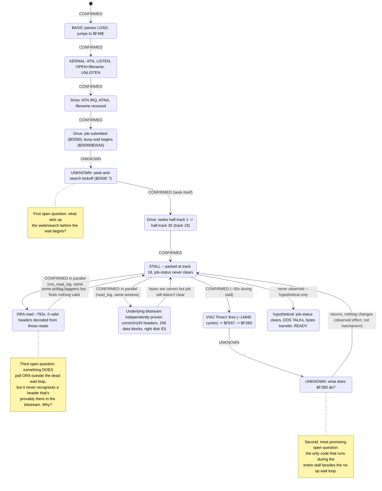

# 1541 disk drive + IEC bus: design plan

> Design notes written while the 1541 emulation was built. File and type
> names refer to the code as it was then; the drive now lives in
> `crates/c64-core/src/drive1541/` (`mechanics.rs`, `electronics/`), the
> VIA in `via/`, the serial bus in `cbm_iec.rs`, and disks in `media/`.

Companion document to the C64 core. Written before scaffolding, per this
project's convention for any new major subsystem.

## Sources and verification method

Community references for 1541 internals turned out to have a genuine
cross-source conflict on the single most load-bearing fact (which VIA lives
at which address) and several single-source claims. Rather than picking a
side by vote, the ambiguous points were resolved **empirically against the
user-supplied real DOS ROM** (`dos1541.rom`, 16384 bytes, mapped $C000-$FFFF):
the ROM's own code was disassembled (flow-traced from the RESET/IRQ/NMI
vectors, plus a brute-force absolute-addressing-operand scan cross-checked
against the flow-traced set) to see which addresses the real 6502 firmware
actually touches, in what patterns. This is the same "let the real ROM
settle it" approach used earlier in this project (see `crabs.rs`'s BASIC
relocation fix). Where the datasheet is the authority instead (the 6522's
own register semantics are chip-level, not Commodore-specific), the WDC
W65C22S datasheet (<https://eater.net/datasheets/w65c22.pdf>) was used
directly rather than a secondary description of it.

### Confirmed facts (with how they were confirmed)

- **$1800-$180F = VIA1 (serial/IEC), $1C00-$1C0F = VIA2 (drive/mechanics).**
  Community sources split 4-vs-1 on this (one OCR'd extraction of the
  official service manual had it backwards). Settled decisively by
  disassembly: $1C00's register block shows the full, heavily-used pattern
  of a real VIA (ORB/ORA/DDRB/DDRA/T1/ACR/PCR/IFR/IER all touched, with
  ORA and PCR especially hot — consistent with disk-mechanics code
  constantly reassembling GCR bytes and flipping read/write mode), while
  $1800 shows a lighter, IEC-bit-banging-shaped pattern (ORB toggled with
  small, specific masks like `ORA #$10`/`AND #$EF`, matching ATN-acknowledge
  and clock/data bit manipulation, not motor control).
- **VIA1 Port B bit map**: bit7 = ATN IN, bit4 = ATNA (ATN acknowledge,
  output), bit3 = CLOCK OUT, bit2 = CLOCK IN, bit1 = DATA OUT, bit0 = DATA
  IN. Confirmed by reading the ROM's ATN-received handler at $E85B-$E90D
  directly: it sets bit4 (`ORA #$10`) immediately on entry (ATNA, to
  auto-acknowledge ATN per the IEC protocol's 1ms DATA-low requirement),
  then polls bit7 (ATN still asserted?) and bit2 (CLOCK IN, waiting for the
  talker's clock edge) in the exact sequence the IEC protocol's byte-receive
  handshake requires.
- **VIA1 CA1 = ATN, *positive* edge, causes an IRQ the DOS actually
  services.** The IRQ handler at $FE67 does `LDA $180D` (VIA1's IFR)
  `AND #$02` (IFR bit 1 = CA1, per the datasheet's IFR table) and, if set,
  calls the ATN handler at $E853, which begins with a dummy `LDA $1801`
  (VIA1's ORA) — read not for its data (VIA1's Port A carries no IEC
  signal; community sources agree it's otherwise unused on a plain 1541,
  and this project does not implement a 1571's superset Port A functions)
  but purely as the side effect that clears CA1's latched IFR bit on a real
  6522 when CA1 isn't in "independent interrupt" mode. **The edge polarity
  is positive, not negative as an earlier pass through this ROM assumed by
  default rather than actually checking the PCR write**: `$EB2F` programs
  VIA1's PCR to `$01` (bit 0 = 1 selects positive-edge CA1), and `$EB37`
  programs IER to `$82` (enabling it) — found only once real LOAD/SAVE
  testing (Task 9) turned up a `?DEVICE NOT PRESENT` error that traced back
  to the drive never once seeing an ATN interrupt. This isn't a
  contradiction of the ATN IN polarity below, but the same fact from a
  different angle: CA1 shares ATN IN's already-inverted signal path (idle
  reads low, asserted reads high), so idle-to-asserted is a *rising* edge,
  and PCR `$01` is exactly the configuration that fires on it.
- **VIA2 Port B bit map**: confirmed two ways at once. First, the DDRB
  value the ROM programs at boot ($F259 `LDA #$6F` / `STA $1C02`) is
  `01101111` — bits 0,1,2,3,5,6 output and bits 4,7 input — which matches
  exactly (and only) the expected assignment: stepper motor phase (0,1),
  spindle motor (2), LED (3), density select (5,6) as outputs; write-protect
  sense (4) and sync-detected (7) as inputs. Second, community sources
  (Schepers' 1541 map, an independent "All About Your 1541" writeup, and a
  drive-internals deep-dive) agree on the same bit meanings.
- **VIA2 Port A ($1C01) = the assembled GCR data byte**, read when a byte
  has been read from disk, written when a byte is to be written. Confirmed
  by usage pattern (extremely hot LDA/STA $1C01 in the read/write-loop
  address range $F3xx-$FDxx) and by community sources.
- **VIA2 CA1 = byte-ready, negative edge.** Confirmed: the VIA2 init
  routine at $F259-$F28D programs PCR bit 0 (CA1 edge select) to 0
  (negative edge, per the datasheet) as part of building its final PCR
  value.
- **Standard 6522 IFR/PCR/ACR bit semantics** are taken directly from the
  WDC W65C22S datasheet (bit-for-bit identical to the original MOS 6522 for
  every field this project uses): IFR bit1=CA1, bit6=T1 (both independently
  matched by how the ROM's IRQ handler tests them); PCR CA2/CB2 3-bit codes
  (000/001/010/011 = input modes, 100 = handshake output, 101 = pulse
  output, 110 = manual low, 111 = manual high); ACR T1 mode bits, T2 mode
  bit, shift-register mode bits, PB latching bits.
- **1541 CPU clock is exactly 1MHz**, from a dedicated 16MHz crystal
  divided by 16 on the drive's own board — independent of the host C64's
  PAL/NTSC video standard (the IEC bus carries no shared system clock, only
  asynchronous ATN/CLOCK/DATA handshake lines).
- **GCR 4-to-5 nibble table** and **sectors-per-track speed zones**
  (1-17:21, 18-24:19, 25-30:18, 31-35:17, matching density-select codes
  11/10/01/00) are corroborated by three-plus independent community
  sources and are not Commodore-internal secrets (the 4040/2040's IEEE-488
  drives used the same GCR table), so were not re-derived from the ROM.
- **D64/G64 container formats** are third-party-documented file formats
  (Peter Schepers' D64.TXT/G64.TXT, matching VICE's own manual) rather than
  hardware facts, so no ROM cross-check applies to them.

### One correction to a plausible-sounding community claim

One community source claimed VIA2's CA2 is configured for **pulse output**
mode specifically to gate the byte-ready signal onto the 6502's SO
(Set-Overflow) pin — i.e. that the SO-pin trick is *routed through* CA2's
VIA-controlled pulse mode. The disassembled init routine disproves the
"pulse" part: the actual PCR value the ROM programs (`$EE` =
`0b1110_1110`) puts **both CA2 and CB2 in manual *output* mode** (CA2 =
`111` = manual output high; CB2 = `111` = manual output high, later
toggled to `110`/low elsewhere to select write mode) — not `101` (pulse
output) for either. This project therefore models the byte-ready → SO pin
connection as a **direct hardware signal**, entirely independent of VIA2's
CA2 configuration (CA2 is modelled as a plain PCR-controlled output/input
per the datasheet, with no special SO-pin behaviour attached to it) — the
same conclusion other sources reached by a different route (SO is wired
straight to the same flip-flop that also feeds CA1, not gated through any
VIA register). CA2's actual physical role beyond "the ROM leaves it as a
static output" is not needed for correct emulation and is left
unmodelled/inert, same spirit as this project's existing documented
simplifications elsewhere (e.g. VIC-II sprite DMA cycle stealing).

### Two more corrections found while building the drive mechanics

Disassembling the actual seek routine (`$FA2E`-`$FA78`) settled two more
details that community sources state inconsistently or ambiguously, the
same way the CA2/SO-pin claim was settled above:

- **Stepper phase direction.** The seek loop keeps a signed "tracks still
  to travel" counter (zero page `$4A`); when positive it does
  `DEC $4A; LDX $1C00; INX; ...; AND #$03` (phase = `(phase+1) mod 4`) each
  step, and when negative it does `INC $4A; LDX $1C00; DEX; ...`
  (phase = `(phase-1) mod 4`). So **incrementing the 2-bit phase steps
  toward a higher track number; decrementing steps toward a lower one** --
  confirmed directly from the ROM rather than assumed from a generic
  "4-phase stepper" description.
- **Write-protect sense polarity.** `$FB00`'s format/write-setup routine
  does `LDA $1C00; AND #$10; BNE $FB0C` where `$FB0C` is the "proceed"
  path and falling through (bit clear) leads into `LDA #$08; JMP $FDD3`
  (an error-result path). That means **bit 4 = 1 means *not* write
  protected, bit 4 = 0 means protected** -- the opposite of one of the two
  conflicting polarities community sources gave, and confirmed here from
  the ROM actually branching the write-permitted way specifically when the
  bit is *set*.

### IEC bus: what's modeled now vs. deferred to bus integration

`iec.rs` models the bus itself as a pure wired-AND: every line's level is
just "is anyone currently asserting it", recomputed from scratch each
update rather than carrying its own remembered state -- true to the real
open-collector electronics, where there's no such thing as a line's level
independent of what everyone's currently doing to it.

The **drive side** is confirmed the same way the rest of this document is,
directly from the real DOS ROM:
- VIA1 Port B bit map (bit0=DATA IN, bit1=DATA OUT, bit2=CLOCK IN,
  bit3=CLOCK OUT, bit4=ATNA, bit7=ATN IN) -- already listed above.
- **ATNA hardware acknowledge**: the ATN handler at `$E85B` sets ATNA
  (`ORA #$10`) as its very first action, before doing anything else --
  confirmed by simply reading the handler's entry sequence. The IEC
  protocol requires a listener to pull DATA low within 1ms of ATN being
  asserted, which a purely software/interrupt-driven response can't
  reliably guarantee, so real 1541 hardware gates ATNA with the live ATN
  line: DATA is forced low whenever both are true, regardless of VIA1's
  own DATA-OUT bit. `via1_iec_output` models exactly this gate.

The **C64 side** (CIA2 Port A's exact bit-for-bit polarity -- which of ATN
OUT/CLOCK OUT/DATA OUT/CLOCK IN/DATA IN are inverted by the board's 7406
buffers) is now confirmed too, disassembling the real `kernal.rom` the same
rigorous way rather than trusting a remembered polarity table:
- $DD00 bits 3/4/5 are ATN/CLOCK/DATA OUT, bits 6/7 are CLOCK/DATA IN (bits
  0-1 are the VIC-II bank select, bit 2 is RS-232 TXD -- neither relevant
  here). DDRA is confirmed set to `$3F` at boot (`$FDD0: LDA #$3F` /
  `$FDD2: STA $DD02`), matching that output/input split exactly.
- **Output polarity**: bit=1 asserts/pulls the line low, bit=0 releases it
  -- confirmed from the KERNAL's TALK/LISTEN routine at `$ED2E`, whose
  first act of asserting ATN is `LDA $DD00 / ORA #$08 / STA $DD00`,
  *setting* bit 3.
- **Input polarity is the opposite of output** (bit=1 idle/high, bit=0
  asserted/low). This falls out of a round-trip check against the ROM's
  own bit-level protocol rather than a remembered convention: the
  byte-send routine at `$ED6E` sends a `0` bit by *asserting* DATA (`JSR
  $EEA0`, sets bit 5) and a `1` bit by *releasing* it (`JSR $EE97`, clears
  bit 5), while `ACPTR` (byte receive, `$EE13`) reconstructs the received
  byte by rotating bit 7 (DATA IN) straight into the result with no
  software inversion (`$EE65: ROR $A4`). For a sent `0` to come back out
  of that rotate as a received `0` with no inversion in between, bit 7
  must itself read `0` while the line is low -- the opposite sense from
  the output bits.

`cia2_iec_output`/`cia2_iec_input_bits` in `iec.rs` implement this
translation, wired to CIA2's Port A pins via the same `pa_ext`
external-input mechanism `bus.rs`'s `Cia` struct already uses for the
keyboard matrix.

**VIA1's own input-bit polarity** (DATA IN/CLOCK IN/ATN IN) turned out to
follow a *different* convention than CIA2's: `1` = asserted, `0` = idle --
the *same* sense as VIA1's own output bits, not inverted the way CIA2's
input side is. Two of the three are directly confirmed by disassembling
`dos1541.rom` (DATA IN via the byte-receive loop's `EOR #$01` before
rotating a bit into the result byte; ATN IN via the ATN handler's
`LDA $1800 / BPL` release-wait loop testing bit 7 directly); CLOCK IN
follows by the same uniform pattern rather than being independently
re-derived bit-by-bit. See `iec::via1_iec_input_bits`'s doc comment for the
full derivation.

### `Drive1541` + top-level integration (implemented)

`drive1541::drive::Drive1541` is the whole drive as one unit: its own
`cpu::Cpu`, a `DriveBus` (2KB RAM mirrored to fill `$0000-$17FF`, VIA1 at
`$1800-$1BFF`, VIA2 at `$1C00-$1FFF`, both mirrored every 16 bytes, 16KB DOS
ROM at `$C000-$FFFF`) implementing `cpu::Bus` for that map, exactly
mirroring the `bus::Memory`/`cpu::Cpu` split at the top level (and for the
same reason: a struct can't lend `&mut self` to a method on its own field
while also passing `&mut self` as that method's `Bus` argument). VIA2's
byte-ready is wired to both its own CA1 (a one-cycle-wide negative pulse)
and, via `Drive1541`'s `cpu::Bus::take_so_edge` impl, directly to the CPU's
SO pin, per the CA2/SO-pin correction above.

`bus::Memory` gained a `Vec<Drive1541>` and an `iec::IecBus`. Cross-clock
co-simulation happens inside `Memory::tick()` -- already the single choke
point every elapsed C64 cycle passes through, before the VIC-II/CIA
advances -- via two steps run every single cycle (not once per
instruction): `update_iec_bus()` recomputes the shared lines from both
sides' *current* pin state and feeds the result back to both, then each
drive's `tick_from_c64(clock_hz)` advances by whatever fraction of a 1541
cycle that one C64 cycle is worth. That fraction is tracked with an
exact-integer rational accumulator scaled by the C64's clock rate (no
floats, no drift -- the same technique `mechanics.rs`'s bit-cell clock
uses), running one whole drive instruction whenever a full 1541 cycle is
owed; since `cpu::Cpu::step` is instruction-atomic, this can overshoot by
up to one instruction's cycles, exactly the tradeoff `Machine::run_cycles`
already documents and accepts for the C64 side alone. This is a deliberate
departure from this document's original phasing note, which sketched an
`f64`-based accumulator -- that would have reintroduced exactly the kind of
float drift this project otherwise avoids everywhere else.

Disk insertion is `Memory::attach_drive(dos_rom) -> Result<usize, String>`
(device 8 = index 0, device 9 = index 1, ...) plus `insert_disk(index,
image)` (detects D64 vs G64 by the G64's own `"GCR-1541"` signature),
`eject_disk(index) -> Option<Disk>`, and `extract_disk(index) ->
Option<Vec<u8>>` (a non-destructive `Disk::to_d64()` export -- the "SAVE"
half: whatever the real DOS ROM has written to its in-memory `Disk` comes
back out on demand, not through a side channel that bypasses the real
DOS). `c64-wasm`'s `Machine` exposes the same four operations to JS.

Verified end to end (not just unit-tested in isolation) in
`tests/drive1541_boot.rs` (the real DOS ROM boots on a standalone
`Drive1541` and programs both VIAs exactly as documented above -- reaching
VIA2's init takes just over 1,000,000 cycles, almost entirely a full
ROM self-checksum pass, empirically timed with `py65` against this same
ROM image) and `tests/drive1541_bus_integration.rs` (a real C64 *and* a
real 1541 running side by side through `Memory::tick()`, with ATN asserted
by writing straight to `$DD00` and confirmed reaching the drive's VIA1 PB7
with no drive-side CPU involvement needed -- the actual cross-chip wiring
working, not just each side's internals).

### Still open / accepted as documented assumptions

- VIA2 CB2's exact wiring (read/write head mode select, high=read/low=write)
  matches one clean community source and is *consistent* with the PCR
  values seen (manual output codes, toggled between calls), but wasn't
  independently re-derived bit-by-bit from the ROM the way Port B was —
  accepted as documented, not proven from first principles.
- The precise on-disk byte-for-byte order of header/data block fields
  (e.g. whether checksum precedes or follows track/sector in the physical
  bit order) and the exact off-byte/gap counts are known only from a single
  detailed source (a "4040 Anatomy" writeup) with byte-count arithmetic that
  self-checks (10 GCR bytes/header a matches 8 raw bytes, 325 GCR
  bytes/data block matches 260 raw bytes) but isn't independently
  re-confirmed. This project's plan is to treat the **real DOS ROM's own
  checksum verification as the test oracle**: if synthesized GCR tracks
  round-trip correctly through the real ROM's own read routines (which is
  exactly what `tests/` will exercise), the byte layout is right by
  construction, regardless of whether a document described it perfectly.

## Module layout

New `crates/c64-core/src/drive1541/` module:

- `via.rs` — generic MOS 6522 VIA (`Via` struct), address-space and
  wiring agnostic: exposes register read/write, a `tick()` for timers, and
  plain getter/setter hooks for the two 8-bit port *pins* (as distinct from
  the port *registers* — a real port pin reads back the actual driven line
  state, which is a mix of DDR-as-output bits driving ORx and DDR-as-input
  bits reflecting whatever the outside world is driving) plus CA1/CA2/CB1/
  CB2 edge/level inputs. Used for both VIA1 and VIA2 (two independent
  instances) — no 1541-specific knowledge lives here at all, mirroring how
  `cpu::Cpu` has no C64-specific knowledge either.
- `gcr.rs` — the 4-to-5 nibble table and byte-level GCR encode/decode,
  plus sector header/data block synthesis (sync + fields + checksum + gaps)
  used to build a full track's raw GCR byte stream from 256-byte sectors,
  and the reverse (decode a captured track back into sectors, for tests and
  for round-tripping G64 write-back).
- `disk.rs` — `Disk` (a set of per-(half-)track raw GCR byte buffers plus a
  write-protect flag), `Disk::from_d64(bytes) -> Disk` (via `gcr.rs`'s
  synthesis) and `Disk::from_g64(bytes) -> Disk` (direct container parse,
  no GCR synthesis needed), and `Disk::to_d64(&self) -> Vec<u8>` (decode
  each track back to sectors — needed for SAVE round-tripping back to a
  D64 the host application can persist).
- `mechanics.rs` — head position (half-tracks 2-70, i.e. tracks 1-35),
  stepper motor phase decode from VIA2 PB0-1 edge changes, spindle
  motor/LED/write-protect/density state from VIA2 PB, the bit-cell clock
  (from density, per the confirmed bit-rate table) driving how fast the
  head walks through the current track's GCR byte buffer, sync-mark
  detection setting VIA2 CA1 (byte-ready) and exposing the "last assembled
  byte" for VIA2 PA, and read/write mode from CB2.
- `drive.rs` — `Drive1541` struct: `cpu::Cpu` + 2KB RAM + 16KB ROM + VIA1 +
  VIA2 + `mechanics::Mechanics`, implementing `cpu::Bus` for its own memory
  map (RAM $0000-$07FF mirrored per the confirmed map, VIA1 $1800-$1BFF
  mirrored every 16 bytes, VIA2 $1C00-$1FFF mirrored every 16 bytes, ROM
  $C000-$FFFF), wiring VIA2's byte-ready CA1 edge directly to the CPU's SO
  input per the correction above, and exposing the IEC-facing VIA1 pins for
  the bus module to read/drive.
- `iec.rs` — `IecBus`: models ATN/CLOCK/DATA as the wired-AND of every
  attached device's "am I pulling this line low" bit (open collector, per
  the confirmed CIA2 polarity: a device *asserts* a line by driving it low;
  the bus reads high only if nobody pulls it low). Takes the C64 side's
  three output bits (from CIA2 PA3-5, already un-inverted at that layer)
  and each drive's VIA1 PB0-3 output bits, computes the resulting line
  levels, and reports them back for CIA2 PA6-7 and VIA1 PB0/2/7 input reads.

Top-level `bus::Memory` gains an optional `Vec<Drive1541>` (device 8, 9, ...)
and a `Bus`-level `iec: IecBus`. `Memory::tick()` (already the single choke
point every C64 cycle passes through) additionally advances each attached
drive by the correct fraction of a 1541 cycle for the elapsed C64 cycle,
via a rational accumulator (`drive_cycle_credit: f64 += 1_000_000.0 /
clock_hz(); while drive_cycle_credit >= 1.0 { drive.tick(); credit -= 1.0
}`) — both sides stay cycle-stepped and independently clocked, matching
this project's "always cycle-accurate, the only knob is real-time-vs-free-
running" rule; nothing here throttles to wall-clock time. **As built, this
accumulator is exact-integer rather than `f64`** — see "`Drive1541` +
top-level integration (implemented)" above for why and for the actual
formula.

Disk insertion: `Machine::insert_disk(drive: u8, image: &[u8], format:
DiskFormat)` (WASM-exposed) / `Memory::insert_disk` (core), detecting D64
vs G64 by size/signature if `format` isn't given explicitly, replacing that
drive's `Disk`. `Machine::eject_disk`/`extract_disk` (the latter calling
`Disk::to_d64`) round out the "load/save a file" mechanism the user asked
for — SAVE support means capturing whatever the drive DOS itself wrote to
its in-memory `Disk`, then exporting it back to D64 bytes on demand, not a
side-channel that bypasses the real DOS. As built, `insert_disk` takes a
plain drive index rather than a separate `format` argument, always
detecting D64 vs G64 automatically (see above).

## Phasing (see task list)

1. VIA (generic, chip-level, no 1541 knowledge) + unit tests against the
   datasheet's own documented timer/shift-register/interrupt behaviour.
2. GCR codec + unit tests (round-trip a sector through encode/decode).
3. D64 + G64 parsing into `Disk` + unit tests (round-trip a synthetic D64).
4. Drive mechanics (motor/head/sync) + unit tests driving VIA2 directly,
   same low-level style as `tests/sprites.rs`/`tests/crab_collision.rs`.
5. IEC bus wiring + unit tests (two synthetic devices pulling lines,
   confirm wired-AND).
6. `Drive1541` + cross-clock integration into `Memory`, insert-disk API.
7. End-to-end demo/tests: boot real C64 + real 1541 ROMs, insert a D64,
   type `LOAD"$",8`, `LOAD"name",8,1`, `RUN`, and a `SAVE` round-trip,
   verified via screen dumps and re-decoded disk bytes — same spirit as
   `crabs.rs`. **In progress, blocked on a LOAD stall — see the section
   below for the full investigation log, what's confirmed sound, and the
   current plan to unblock it.**

## Task 9: end-to-end LOAD/SAVE — investigation log and current plan

### Status

`LOAD"$",8` and `LOAD"HELLO",8,1` both hang indefinitely: the screen shows
`SEARCHING FOR $`/`SEARCHING FOR HELLO` and never progresses. A wide net of
independent checks (below) has ruled out the disk image, the GCR codec, the
IEC bus/ATN handshake, the device-ID wiring, the sync-mark detector, and the
drive mechanics' write path. **Updated this session**: `$F2B0`/`$D50E` have
now been disassembled and the dispatcher's own activity ground-truth-traced
(see "Disassembly + ground-truth trace results" below), and this *disproves*
the previous working theory. The drive's job-dispatch/header-search code is
not the problem — it correctly seeks to track 18 and successfully completes
two seek jobs and two read jobs (all status `$01` = success) within the
first ~4.8M cycles of the attempt. **Root cause now found** (see
"Root cause found: a lost race..." below): it isn't a missing dispatch
path at all. The C64 sends TALK 8 under ATN at cycle ~2.91M, but the
drive is deep inside a *foreground* busy-wait (`$D599`/`$D5A6`, servicing
the `"$"`-open handler's motor-spinup + seek + GCR-header-read job) that
doesn't return control to the main loop — and hence to the ATN handler —
until cycle ~4.77M, 1.85M cycles later. The KERNAL's own TALK-send routine
times out after only ~1,166 cycles (`$90` status byte confirmed `$80`,
"device not present"), silently swallows that failure instead of
propagating it to BASIC, and sails on into the receive-byte wait
(`$EE13`/`$EEA9`/`$EDD9`) that spins forever. Every step of this chain is
now confirmed either from fresh `roms/1541.rom`/`roms/kernal.rom`
disassembly or matching ground-truth trace lines already captured — the
dispatch/protocol code matches the real ROM byte-for-byte. What's left is
narrower: work out whether this emulator's motor-spinup+seek+retry timing
is genuinely slower than real 1541 hardware (most likely) or whether the
KERNAL's ATNA timeout window is being measured wrong on the C64 side —
see the re-scoped "Proposed next steps" below.

### This session's findings

**Two real, independent bugs were found and fixed, neither of which turned
out to be the LOAD stall** (confirmed by re-running `load_hello` after both
fixes: byte-for-byte the same `SEARCHING FOR HELLO` freeze, same
`drive.pc`/track/`byte_ready_count` signature as before). They were found
while pursuing the user's suggestion to use a write operation as a
differential diagnostic, and are worth keeping fixed regardless:

1. **`Mechanics::advance_one_bit`'s write-mode underrun bug** (the real
   root cause of the write-path corruption). When the CPU hadn't fed a new
   byte via `write_byte` in time, the write path forced a fabricated `0`
   bit onto the track. A real write serializer that isn't reloaded doesn't
   reset to zero — it keeps outputting whatever bit was already latched on
   its output line. Tracing the actual byte sequence the real DOS ROM
   writes confirmed this is exactly what the hardware relies on: the ROM
   writes a sync mark as a *single* `$FF` byte, then spends several
   byte-times on other housekeeping before writing real data, counting on
   the line being held high the whole time rather than re-issuing `$FF`
   itself. Forcing zero instead chopped every sync mark short and smeared
   zero bytes into what should have been the rest of it, corrupting every
   direct-access block write (`B-P`/`U2`). Fixed by adding `last_write_bit`
   and repeating it on underrun instead of fabricating `0`. Confirmed fix:
   the DOS now writes a block cleanly on the *first* attempt
   (`write_mode_entries` dropped from 11 retries to 1) instead of retrying
   against its own verify failures.
2. **`Disk::decode_track_sectors`'s byte-aligned sync scan** (a second,
   independent bug this surfaced — in the `to_d64()`/export path, *not*
   the live emulated read path). It scanned for sync marks by checking
   whether whole bytes equal `0xFF`. A sector written by real bit-level
   write mechanics lands at whatever arbitrary bit offset the head
   happened to be at when writing began — it has no reason to be
   byte-aligned — so a correctly-written sync mark that straddles a byte
   boundary was invisible to this scanner even though every bit was right.
   Rewrote it to scan at the bit level (10 consecutive 1-bits, the real
   hardware minimum, matching `Mechanics::sync_input_bit`'s own
   convention), re-packing whatever it finds into a fresh byte-aligned
   buffer before handing it to the existing GCR decoder. This only affects
   `to_d64()`/export (used by host-side SAVE, and by diagnostics like
   `stub_read_hello.rs`); the live, CPU-driven read path in
   `Mechanics::advance_one_bit` already tracks sync bit-by-bit and was
   never affected by either bug.

End-to-end confirmation of the fix: a new `write_test` mode in
`examples/load_probe.rs` opens a direct-access channel (`OPEN2,8,2,"#"`),
positions the buffer (`B-P:2,0`), writes `"HI1541"`, and issues a block
write (`U2:2,0,2,0`) to track 2 sector 0 of `hello.d64` — chosen to avoid
re-exercising the already-suspect track 18/track 1 seek history. After the
fix, this reports `WRITE SUCCEEDED`: ejecting the disk and decoding it
independently via `Disk::to_d64()` recovers `"HI1541"` exactly where it was
told to go. Full test suite: 72/72 lib tests plus all integration tests
green, no regressions; `stub_read_hello.rs`'s full-disk round-trip (zero
CPU/VIA/mechanics involvement) still passes byte-for-byte, confirming the
bit-level rewrite didn't disturb the ordinary byte-aligned case.

**Also confirmed this session** (from the user-supplied 1541 repair manual,
cross-checked against this project's existing model):

- **Device number (8-11) is configurable**, wired to VIA1 Port B bits 5
  (low) and 6 (high) — confirmed via disassembly of the ROM's own
  reset-time TALK-address computation (`$EB3A-$EB47`:
  `LDA $1800/AND #$60/ASL A/ROL A/ROL A/ROL A/ORA #$48`), cross-validated
  against the manual's Table 1-4 ("Selecting Device Number"). Implemented
  as `Drive1541::with_device_id`/`attach_drive_with_device_id`, validated
  to the 8-11 range, with its own tests.
- **The sync-mark detector's "at least 10 ones in succession" threshold**
  (Section 2.4.8 of the manual) matches this project's `sync_run >= 10`
  exactly — not just a community convention, confirmed from Commodore's
  own service documentation. A new test proves the implementation clears
  on the very first `0` bit after a sync run ends, with no latching or
  decay, matching a literal 10-bit shift register's behavior.

### Confirmed sound (ruled out as the cause of the LOAD stall)

Everything below has been independently verified, mostly via ground-truth
checks that don't go through the code path under suspicion:

- **Disk image / GCR synthesis**: `Disk::from_d64()` → `Disk::to_d64()`
  round-trips the entire 174,848-byte `hello.d64` byte-for-byte with zero
  CPU/VIA/mechanics involvement (`stub_read_hello.rs`). A from-scratch
  directory walk of the same bytes finds HELLO's directory entry (type
  `$82`) and correctly follows its sector chain to a well-formed 36-byte
  BASIC program on track 1 sector 0 (track 18 is purely the directory/BAM
  — HELLO's actual data is *not* there).
- **The drive mechanics' read path**: the unaliased `Mechanics::read_log`
  (populated from inside the per-cycle `tick()`, not sampled from outside)
  shows 45 valid, correctly-sequenced track=18 sector headers (cycling
  sectors 0-18, correct disk ID) and 156 valid data blocks, captured at the
  exact moment the head leaves track 18 — i.e. spanning the *entire* stall
  window. Real, correctly-framed bytes are flowing past the read head and
  being assembled correctly the whole time the DOS is stuck.
- **CPU/1541 coupling model**: `bus::Memory::tick()` steps the C64 side,
  recomputes the IEC bus, then calls each drive's `tick_from_c64`, which
  uses an exact-integer accumulator (no float drift) to run the drive's own
  CPU by whatever fraction of a 1541 cycle is owed. Both CPUs execute whole
  instructions atomically, not sub-instruction lockstep — matches the
  user's own description of the likely model, confirmed by reading the
  code rather than restating it from memory.
- **IEC bus / ATN handshake**: `LISTEN`+`OPEN`+filename and `UNLISTEN` are
  received correctly (this is *how* the drive gets as far as submitting the
  job and seeking to track 18 at all); the earlier ATN-edge-polarity bug
  that caused `?DEVICE NOT PRESENT` is long fixed.
- **Device ID and sync-mark detector**: see above.
- **The drive mechanics' write path**: see "This session's findings" above
  — now independently confirmed correct end to end via `write_test`.
- **The job-dispatch/busy-wait mechanism is not universally broken.** A
  direct-access block *write* job dispatches, causes a real seek away from
  track 18, writes real bytes, turns the motor off, and returns to the
  DOS's idle loop (`$EC00`-ish) with the job-status byte at `$00` (success,
  no error) — a completely different, successful outcome from LOAD's
  stall. Whatever's broken is specific to the read/header-search job, not
  the shared mechanism every job type funnels through.

### Detailed sequence of events after `LOAD"$",8,1` (or `LOAD"HELLO",8,1`)

Both commands drive the identical KERNAL routine (`$F49E`) and hit the
identical drive-side stall, so they're described together. Each step below
is marked **CONFIRMED** (directly observed/disassembled this investigation)
or **UNKNOWN** (not yet disassembled; described from generic community
1541 lore where noted, which has already proven unreliable enough times in
this project — see the corrections throughout this document — that it's
not trusted without a ROM check).

1. **BASIC parses the command and jumps to the KERNAL LOAD vector
   (`$F49E`).** *UNKNOWN in the sense of "not re-disassembled this
   session"* — this is foundational C64 KERNAL behavior already relied on
   throughout this project, not something Task 9 specifically called into
   question.
2. **KERNAL asserts ATN, sends LISTEN+device address, then OPEN+filename
   bytes (`"$"` or `"HELLO"`), then UNLISTEN.** **CONFIRMED** — this is how
   the drive receives the command at all; the IEC-level byte handshake
   tests pass and the drive visibly acts on the filename.
3. **Drive's VIA1 CA1 (ATN, positive edge) fires an IRQ; the ATN handler
   (`$E853`/`$E85B`) asserts ATNA and the byte-receive handshake collects
   LISTEN+OPEN+filename+UNLISTEN.** **CONFIRMED.**
4. **DOS parses the filename, decides which job to submit, writes the job
   code (`$D590`: `STA $024D`, `$80`=read or `$90`=write chosen at
   `$D586-$D58C`), then busy-waits at `$D599` (`JSR $D5A6` / `BCS $D599`)
   polling a zero-page job-status byte.** **CONFIRMED** — `$D586-$D5C6` is
   fully disassembled. Critically, `$D5A6` itself
   (`LDA $00,X/BMI.../CMP #$02/BCC.../CMP #$08,#$0B,#$0F/BEQ.../BNE $D5C6`)
   is a pure read-and-branch with **no VIA register access and no other
   side effect** — it cannot itself advance anything. Whatever is supposed
   to clear the job-status byte must happen *outside* this loop, driven by
   something else (confirmed: the Timer1 IRQ, next).
5. **UNKNOWN: what actually kicks off the seek-and-search.** Earlier
   tracing noted `$D50E` is called just before the busy-wait begins, but
   its contents haven't been disassembled. This is the first genuinely
   open question in the sequence.
6. **Drive steps the head from half-track 1 down to half-track 35 (track
   18, the directory track).** **CONFIRMED** — every half-track transition
   was traced individually; the seek lands on the correct target track by
   the already-confirmed phase-direction logic.
7. **Drive parks at track 18, motor on, and stays there.** **CONFIRMED** —
   per-cycle PC sampling shows `drive.pc` never leaves
   `{$D599, $D5A6, $D5A8, $D5C4, $D5C5, $D59C}` (the busy-wait, step 4) for
   the entire stall, except one brief visit elsewhere caught mid-IRQ. The
   job-status byte never clears. This is the **terminal, observed state**:
   screen shows `SEARCHING FOR ...` forever, no TALK, no byte ever reaches
   the C64 side.
8. **VIA2 Timer1 fires every 14,848 cycles (~30 times during the stall) and
   is dispatched through the shared IRQ handler `$FE67` to `$F2B0`.**
   **CONFIRMED that this fires and dispatches** (via2 IFR/IER/ACR state and
   T1 counter/latch all directly observed, `$FE67`'s ATN/Timer1-only
   dispatch logic fully disassembled). **UNKNOWN what `$F2B0` actually
   does** — not yet disassembled. This is the *only* code that runs during
   the entire stall besides the no-op busy-wait loop itself, which makes it
   the single most promising disassembly target.
9. **Byte-ready (VIA2 CA1) is never itself IRQ-driven in this ROM** —
   confirmed `$FE67` has no CA1 case at all, consistent with this
   project's existing SO-pin-direct model (`iec.rs`/`drive.rs`). Byte
   collection, whatever it looks like, must be done by *polling*
   (presumably via the CPU's SO pin, same mechanism already confirmed
   sound for the write path) somewhere the stall never seems to execute
   with any effect — or executes but never succeeds.
10. **ORA (`$1C01`/`$1C0F`) *is* read during the stall — just rarely, and
    seemingly without success.** One captured window showed 793 ORA reads
    against 68,012 bytes genuinely assembled by the mechanics in the same
    window — consistent with *something* polling for bytes outside the
    no-op wait loop (so not literally dead code), but of those reads, 0
    decoded as a syntactically valid 10-byte header, versus the ~45 valid
    headers independently proven present in the underlying bitstream.
    **CONFIRMED the discrepancy; UNKNOWN why** — this is the most
    concrete, reproducible anomaly to chase next.

**Hypothetical continuation (never actually observed — the stall always
preempts it)**: job-status byte clears → DOS proceeds to TALK in response
to the C64's follow-up TALK+read sequence → collected sector bytes
transferred over IEC byte-by-byte → EOI on the last byte → UNTALK → KERNAL
either renders the directory listing (`"$"`) or has the PRG bytes loaded
into C64 RAM → `READY.` returns. This is standard LOAD behavior, not
specific to this ROM, and is included only to show what step 7-10 is
supposed to lead to.

#### State diagram

**This whole diagram is now superseded by the findings in the next section** —
kept here for the historical record of how the investigation got there, not
as the current model.

### Disassembly + ground-truth trace results: the stall is not where we thought

Per the plan above, `$F2B0` and `$D50E` were disassembled in full this
session (`py65`, same methodology as every other disassembly in this doc —
see scripts in `/tmp/disasm_*.py`, not checked in). That, plus a new
ground-truth trace mode (`load_probe f2b0_trace`, kept in `load_probe.rs`),
answered all three open questions from the diagram above — and the answer
to the second one overturns the working theory this doc had going into the
session.

**What `$F2B0` actually is.** It is the Timer1-IRQ job dispatcher for *all*
drive jobs, not a header-search routine specifically:

- On entry it acks the Timer1 IRQ (`LDA $1c04`) and clears VIA2's
  CA1/CA2/SR interrupt flags (`LDA $1c0c / ORA #$0e / STA $1c0c`) — this is
  almost certainly what an earlier session misread as `via2_ifr`
  "persisting": it gets cleared unconditionally on *every* tick, so a
  coarse sample can easily miss the clear and look like a stuck flag.
- `$F2BE-$F2F6` scans the 6-byte per-buffer job-status table at `$0000-$0005`
  for the first slot with bit 7 set ("busy"), using `Y` as the slot index.
- If found, `$F2D8` onward is a **resumable incremental seek state machine**:
  one call moves the head one half-track closer to the target (computed via
  a signed delta against a speed-zone table at `$FED1`/`$FED6`), then
  returns via `JMP $f99c` (re-arm, wait for the next tick) — i.e. a single
  seek can legitimately take many Timer1 ticks, one half-track per tick.
  Once positioned, it also sets the VIA2 density-select bits in `$1c00`
  (`AND #$9f / ORA $44`) from the same speed-zone table — exactly the real
  per-zone GCR density behavior, confirmed correct.
- After seek completion it dispatches on a job-state nibble at `$45`
  (`$45 AND $78` of the raw job code, extracted by helper `$f393`/`$f395`):
  `$45==$40` -> `$f37c` (a short motor/VIA cleanup, immediate success);
  `$45==$60` -> resumes via an indirect per-job vector at zero page
  `$30/$31` (a coroutine-style "continue this job's own custom code" jump,
  confirming jobs *can* span many ticks by saving their own resume point);
  anything else (in particular `$45==$30`, the masked form of raw job code
  `$B0` = "seek, read a header to verify track" -- and `$45==$00`, raw code
  `$80` = "read a sector") falls into `$F3B1`.
- `$F3B1` is the real GCR header-read code: sets a retry budget `$4B=$5A`
  (90), expects the first post-sync GCR byte to be `$52` (`$24`, confirmed
  correct against earlier hex-dump evidence), waits for sync with a bounded
  timeout via `$F556` (a VIA1-timer-backed spin that gives up after a fixed
  cycle budget if `$1c00` bit 7, SYNC detect, never clears), then uses the
  classic SO-pin `BVC`/`CLV` idiom to collect 8 header bytes from `$1c01`,
  checksums/compares them via `$f497`, and compares track/sector against
  `$16`/`$17`. **Crucially, a mismatch (`$f407`) does not retry inside the
  same tick** — it decrements `$4B` and returns to the dispatcher via the
  normal per-tick exit, so a job's full "find sync, read header, validate"
  cycle is retried roughly once per Timer1 tick (not up to 90 times within
  one activation, as this doc previously guessed). `$F969` is the universal
  "job done" exit: `STA $0000,Y` writes the final status into the same
  per-buffer table the main-loop poll reads, then loops back to `$F2BE` to
  service any other busy buffer before finally returning.
- `$D50E`/`$D506` (and the fuller `$D590-$D5A6` busy-wait context pulled in
  alongside it) turned out to be job *submission*, not search-parameter
  setup: `$D590: STA $024d` / `STA $00,X` seeds the buffer's job-status byte
  and a *separate* single-byte mirror at `$024D` (used elsewhere for
  error-message lookups, not by the completion poll), then `$D599: JSR
  $D5A6` busy-waits by reading `$00,X` directly — **the same table `$F2B0`
  writes to**, confirmed by address, not by inference. `$D5A6` treats status
  `0`/`1` as success (`CLC`), bit 7 as still-busy (`SEC`), and specific
  codes (`$08`/`$0B`/`$0F`, or anything else falling through to `$D5C6`) as
  DOS's own automatic-retry territory — i.e. a transient error like "sync
  not found this rotation" is expected and self-heals via the normal
  busy-wait loop, not a bug.

**The ground-truth trace (`load_probe f2b0_trace`)** instruments `$F2B0`,
`$F2D8`, `$F363`, `$F3B1`, `$F3C4`, `$F407`, `$F40B`, `$F96B`, `$D5A6`, and
`$D5C6` (plus the drive's `A`/`X`/`Y` and the relevant zero-page state) and
runs a real `LOAD"$",8` for 150M cycles. Result, read straight off the log:

1. Buffer slot 4 gets a seek job (`$45=$30`), spends ~45 ticks stepping to
   track 18, then succeeds (`$F96B`, status `$01`) at cycle ~3.82M.
2. A second job on slot 4 (`$45=$30` again, almost certainly a settle/
   re-verify step) succeeds at cycle ~4.43M.
3. A read job (`$45=$00`, raw code `$80`) on slot 4 succeeds at cycle
   ~4.55M.
4. A read job on slot 3 succeeds at cycle ~4.76M (`$F3C4` even shows the
   compared byte landing exactly on the expected `$52` on two separate
   attempts right before this).
5. **After that: nothing.** No more busy jobs are ever found (`$F2D8` never
   fires again across the remaining ~145M cycles); the drive's PC and every
   watched zero-page byte go completely static after cycle ~4.77M, settled
   in the ordinary main idle loop (`$EC00`-`$EC3F`, a channel-status/
   job-table housekeeping scan, not an error state). `clock_toggles=80` and
   `data_toggles=51` for the *entire* 150M-cycle run — some IEC activity
   happened (consistent with the earlier ATN/LISTEN/OPEN handshake around
   cycle ~2.9M, confirmed separately in the same log), but it stopped cold
   well before any of the directory-listing bytes could have been sent.
6. The C64 side's own PC is parked at `$EEAF` for the rest of the run —
   inside the KERNAL's serial byte-receive-wait polling loop
   (`$EEA9`/`$EDD9`, hit **5.27 million times each** by the end) — i.e. it
   is actively spinning, waiting for a CLOCK transition from the drive that
   never comes, not frozen or crashed.
7. One more structural fact, found while chasing "what sends the bytes":
   `$CFF1` (called repeatedly by the `$D480`-ish "`$`-directory open"
   handler right after its seek/read jobs, via `LDA $80/$81; JSR $cff1`
   patterns matching a load-address header) is **not** a serial-bus send
   routine at all — it's `PHA / JSR $df93 / BPL.. / STA ($99,X) / INC
   $99,X / RTS`, a generic "append this byte to the channel's own output
   buffer" helper with no VIA1/IEC side effects whatsoever. This confirms
   the directory-listing text is assembled entirely into an in-RAM buffer
   first, fully decoupled from the wire protocol; the actual byte-by-byte
   transmission must be driven by something else entirely (presumably
   TALK-triggered, from the main idle loop's channel-status scan and/or the
   ATN-interrupt dispatch region around `$E850-$E8E0`/`$D2C2`), and *that*
   code has not been disassembled yet.

**One hypothesis raised by the above was tested and refuted, which narrows
things further.** `$D227` (called from the main idle loop's `$D307`/`$D313`
scans, and directly with sentinel values from the `"$"`-open handler) sets a
bit in a global byte at `$0256`; this looked exactly like a per-channel
"ready to TALK" flag. It isn't. A second instrumented run (watching `$0256`,
`$022B,X` for the two buffer slots actually used, `$D227`, `$D307`, `$D313`,
and `$D331`) traced it to ground truth: `$D1DF-$D226` is one coherent
routine — `JSR $d227` (mark the just-finished channel's slot done, set its
bit in `$0256`) immediately followed by `JSR $d37f` (pop the lowest set bit
out of `$0256`, i.e. **allocate a free buffer**) and then initializing three
more per-buffer tables (`$00A7,Y` / `$00AE,Y` / `$00CD,Y`) for whatever newly
*claimed* that buffer. `$0256` is a **free-buffer-slot bitmask for the DOS's
generic buffer allocator**, not a TALK-pending flag — "finish with a buffer"
and "hand it back to the free pool for whatever needs one next" are the same
step, unrelated to notifying the serial/IEC layer that data is ready to
send. The trace confirms this fires exactly once for the real job (`$D227`
at cycle ~4,760,207, immediately after the last read job completes, slot 3,
matching `$3F=03`) and the buffer gets recycled — but that's it; nothing
observed here plausibly also kicks off a TALK-mode byte send. So the actual
"buffer's ready, now go clock bytes out over VIA1" trigger is still
unlocated, and is *not* `$0256`/`$D227`/`$D37F`. The next most likely place
is the tail of the main idle loop's job-status scan (`$EC00-$EC40`, not yet
disassembled past `$EC3E: SEI / LDA $1c00`) and/or a per-channel
"currently-a-pending-talker" flag distinct from the buffer-pool bitmask,
checked somewhere in the ATN-interrupt dispatch region (`$E850-$E8E0`).

**Net effect: every "UNKNOWN" in the previous state diagram is now answered,
and the mystery has moved.** It is not in seeking, not in sync detection,
not in GCR header validation, not in checksum/track/sector verification —
all of that demonstrably works, on this exact disk image, inside this exact
emulator, for this exact command. The open question is narrow and concrete:
**after the buffer-fill job(s) for a `$`/named-file open complete
successfully, what is supposed to transition the drive from "idle, buffer
ready" into "actively clocking bytes out over VIA1 to the waiting C64" —
and why does that transition never happen (or never get reached) here?**

### Further narrowed: the drive never once recognizes a TALK command

Rene pointed at a community disassembly of this exact ROM region (same
addresses as everything confirmed above, including `$EC9E` matching
byte-for-byte) describing the intended chain precisely:
`$E680` (serial command dispatch recognizes TALK) -> `$D0EB` (open channel
for reading) -> back to the ATN-release dispatch at `$E8D7` -> if `$7A`
("I'm being TALKed to") is set, `$E8F1`/`$E8F4` (DATA low / CLOCK high) ->
`$E8F7: JSR $E909` ("send data", which itself gates on `$F2,X` bit 7 before
proceeding — exactly the flag this session's trace already caught being
set to `$88` right after the last read job completes).

Extending `f2b0_trace` to watch `$E680`, `$D0EB`, `$E8ED`/`$E8F1`/`$E8F7`,
`$E909`/`$E916`, and the ATN command-byte compare at `$E887` gives a clean,
decisive answer: **`$E680` is hit zero times across the entire 150M-cycle
run.** The drive's serial command dispatcher never once routes to the TALK
handler. There turn out to be *three* ATN sequences in total, not two —
watching `$E8ED` directly (rather than only the coarser `$79`/`$7A`/`$7C`
flag-change tracker) caught a third one at cycle ~4,771,768, right on the
heels of the buffer-fill finishing at ~4.76M, meaning the C64 *does* make
another attempt once the directory data is ready. But `$7A` (the TALK flag
`$E8ED` checks) is still unset on that third attempt too — `$E8F1` onward,
and therefore `$E909`'s entire send-data chain, never run, in any of the
three cycles. So either the C64 never actually sends a TALK command, or it
sends one the drive's `$77`/`$78` device-address comparison doesn't
recognize as TALK (both are real possibilities — not yet distinguished).

One hypothesis this session's `$EEA9`/`$EDD9` C64-side digging raised and
then had to retract: `cia2_iec_input_bits`'s CLOCK_IN/DATA_IN polarity
(`1`=idle, `0`=asserted — deliberately opposite of CIA2's own output-bit
sense) looked, from a naive real-hardware-polarity assumption, like it
might be inverted. It isn't a bug: `docs/1541-plan.md`'s own "IEC bus"
section above already derives this bit-for-bit from the KERNAL's own
byte-send/byte-receive code (`$ED6E`/`$EE65`), and re-deriving `$EDD6`/
`$EDD9`'s branch sense against that confirmed polarity shows it's a
"wait for the other side to *assert* CLOCK" loop, not "wait for release" as
first guessed — fully consistent with (not contradicting) everything else
found this session. Good to have checked rather than assumed, but it's a
dead end, not the bug.

**Next step, straightforwardly**: find what byte(s) the C64 actually sends
under ATN in each of the three cycles (watch `$E887`, right after `$E8B4`'s
`JSR $e9c9` reads the command byte into `A`) and compare against the
drive's own confirmed TALK address (`$40 | device_number` = `$48` for
device 8, per the device-ID derivation already confirmed in the IEC bus
section above) — this will show directly whether the C64 is sending the
wrong byte, sending nothing at this stage, or sending the right byte that
the drive's comparison is failing to match.

### Root cause found: a lost race between the C64's TALK timeout and the drive's own foreground busy-wait

The `$E680` address quoted above turns out to be a red herring — it's
downstream code gated on `$7A` already being set, not the recognition
point itself, and the whole "three ATN cycles, `$7A` never set" framing was
built on a **garbled disassembly** (a leftover inline py65 script from
earlier in the session had a base-offset bug and was producing nonsense
bytes for `$E9C9`/`$E880-$E8B8`). Re-disassembling `roms/1541.rom` and
`roms/kernal.rom` straight from the ROM files with a clean, from-scratch
script resolves everything cleanly and matches Rene's pasted community
disassembly byte-for-byte at every address checked. With clean ground
truth, re-reading the *existing* `f2b0_trace_run7.log` (no rerun needed)
answers the open question definitively:

1. **There are exactly three real ATN assertions in the entire 150M-cycle
   run** — found by grepping the trace's unconditional `ATN {}->{}
   ` transition line (not a sampled watch, so nothing can hide from it):
   LISTEN 8 + OPEN "$" at cycle 2,908,805-2,910,850; UNLISTEN at
   2,912,446-2,914,669; **TALK 8 at 2,914,909-2,916,075**. ATN is never
   asserted again for the remaining ~148M cycles.
2. **The TALK attempt fails in just 1,166 cycles.** The KERNAL's
   generic "send one byte under ATN" routine (`$ED40`, confirmed from
   `roms/kernal.rom`) asserts ATN, asserts CLOCK OUT, releases DATA OUT,
   delays ~370 cycles (`$EEB3`), then checks via `$EEA9` whether the
   target has pulled DATA low (the mandatory IEC "ATNA" acknowledgment).
   It hasn't, so `$ED47: BCS $EDAD` takes the error path, which sets the
   KERNAL status byte `$90 = $80` ("device not present") — **confirmed by
   the trace's own `ATN true -> false` line at cycle 2,916,075, which
   prints `$90(st)=$80` directly**, and independently confirmed by the C64
   PC trace showing `$EDB2` (inside `$EDAD`'s handler) actually executing
   at cycle 2,916,033.
3. **The drive's ATN handler (`$E85B`) doesn't run until cycle
   4,771,670** — 1.85M cycles (≈1.85 simulated seconds) later. Why: the
   `"$"`-open handler submits its seek+read job and then busy-waits
   (`$D596: JSR $D50E` then `$D599: JSR $D5A6; BCS $D599` — confirmed
   straight from the ROM bytes, not a reimplementation guess) in the
   *foreground*. That spin loop only ever reads the job-status byte; it
   never touches `$7c` or calls anywhere near `$E85B`/`$EC00`. Meanwhile
   the CA1 (ATN-edge) interrupt *does* fire promptly in hardware terms
   (VIA1's IER has CA1 enabled once at boot, `$EB37`, and never touched
   again) and sets `$7c=1` via the tiny `$FE73: JSR $E853` IRQ-time
   handler — but setting `$7c=1` doesn't do anything by itself; nothing
   reads it back out again until the main loop's own `$EC00: LDA $7c`
   check, and that check is never reached while the foreground busy-wait
   owns the CPU. So the pending ATN just sits there, unserviced, for the
   job's entire duration.
   - Breaking the 1.85M cycles down with the half-track-transition log:
     ~917K cycles with the motor off/spinning up and the head still
     parked at track 1 (byte_ready_count already climbing — GCR bytes
     are coming in off track 1 during this stretch, i.e. this is a
     software spin-up/settle delay in the ROM itself, not an artifact of
     our mechanics model — `mechanics.rs`'s `motor_on` is a direct mirror
     of the VIA2 PB bit with no added ramp-up time of its own); then
     34 single-half-track step ticks (`$F2B0`, one per ~14,750-cycle
     Timer1 period, track 1 -> track 18, ~487K cycles, clean and
     monotonic, no retries); then ~440K cycles of GCR header-search/read
     once on-track (`$F2B0`/`$F3B1`'s sync-retry loop, `$4B` observed
     cycling 90->0 across the window per the `F2 pc=` trace samples).
4. **The failure never reaches BASIC.** `$ED47`'s error path (`$EDAD`)
   sets `$90=$80` but then falls straight into the *middle* of the
   UNTALK sequence's tail (`$EDB7: BCC $EE03`) and returns normally
   (`$EDAB`-equivalent `CLI`/`RTS`) — it does **not** set the Carry flag
   on return the way a real KERNAL error return should. BASIC's own
   `LOAD` handler (`$E165` in `kernal.rom`, confirmed: `JSR $FFD5` once,
   `BCS` to the error printer) therefore never sees an error and never
   gets a chance to retry — there is no retry loop anywhere in BASIC's
   LOAD statement. The KERNAL LOAD routine itself (`$F4C8-$F4D5`:
   `JSR $F3D5`/OPEN, `JSR $ED09`/TALK, `JSR $EDC7`/TKSA, `JSR $EE13`/
   ACPTR, confirmed straight from `kernal.rom`) also never checks `$90`
   between TALK and the first `ACPTR` call, so it sails on into
   `$EE13`'s receive-first-byte wait (`$EE1B: JSR $EEA9; BPL $EE1B`),
   which is the infinite loop the C64 is actually stuck in — the
   `$EDD6`/`$EDD9` PC values seen throughout the stall are `$EEA9`'s own
   debounce-read inlined into that same busy-wait pattern, called from
   inside `$EE13`, not a separate routine.

**Net effect**: this is a fully traced, ROM-verified causal chain from
"TALK asserted" to "stuck forever," with every step confirmed either by
fresh disassembly of the actual ROM bytes or by matching trace lines
already captured. The one open question this doesn't answer is *why* a
real C64+1541 pair doesn't lose this exact race in practice (LOAD"$",8
reliably works on real hardware even though the ROM code doing the
busy-wait and the swallowed-error path is, byte for byte, the same code
we just disassembled) — meaning the likely remaining bug isn't in the
protocol/dispatch logic at all (that now matches the real ROM exactly)
but in the *timing budget*: either our ~1.85M-cycle motor-spinup + seek +
GCR-retry duration is substantially longer than real 1541 hardware would
take for this same operation, or the KERNAL's ~1,166-cycle ATNA timeout is
being measured/triggered incorrectly. Either one would make a race that
real hardware normally wins into one this emulator always loses.

### Proposed next steps on the LOAD problem

Superseded by the "Root cause found" section above: the dispatch logic
itself (TALK recognition, the `$7A`/`$79` flags, the ATN handler, the
busy-wait architecture) all now matches the real ROM exactly, confirmed
by direct disassembly of `roms/1541.rom`/`roms/kernal.rom` plus matching
trace evidence — there is no missing flag check or un-wired dispatch
branch to find. The remaining question is purely about *timing budget*:
why does this emulator's motor-spinup + 17-track seek + GCR-retry
sequence take long enough (~1.85M cycles) to lose a race that real
hardware apparently wins. In priority order:

1. **Find a real-hardware timing reference** for 1541 motor spin-up
   time, per-half-track step-settle time, and typical GCR sync-search
   duration for a cold, untouched disk — compare against this run's
   measured breakdown. **Correction to an earlier read of this same
   trace**: `$4B` is *not* a clean, single-purpose retry counter across
   this whole window — the ROM reuses that same zero-page byte as plain
   scratch in the stepper-phase-advance code (`$FA63-$FA75`, confirmed
   from `roms/1541.rom`: `DEC $4A; LDX $1C00; INX; AND #$03; STA $4B; ...`)
   during seeking, which is why the first pass at this data looked like
   "88 retries burned, 0->90 reset" — that was mostly stepper-phase
   values (0-3) bleeding into the same instrumentation field, not failed
   sync attempts. Re-filtering to only the real header-hunt PCs
   (`$F3B1`/`$F3C4`/`$F407`, the actual `DEC $4B` site) gives a cleaner
   picture:
   - ~917K cycles: motor on, head still parked at track 1,
     `byte_ready_count` already climbing — a flat, ROM-timed software
     spin-up/settle delay (`mechanics.rs`'s `motor_on` is a direct,
     un-delayed mirror of the VIA2 PB bit, so this entire figure comes
     from the ROM's own delay loop, not our mechanics model).
   - ~487K cycles: 34 clean, monotonic half-track steps, track 1 -> 18,
     confirmed via the half-track-transition log, no retries.
   - ~6K cycles: a "seek, verify via header" job (any valid header
     confirms the right track) succeeding almost immediately once
     on-track.
   - ~315K cycles for the real targeted-sector read: one wasted pass
     (`$4B` 90->89, ~1 revolution) before a fresh attempt (a new
     `$F3B1` entry resetting `$4B` back to 90 — most likely DOS's own
     higher-level job-retry, not a second manual decrement) succeeds.
   - A further ~208K cycles between that job's own "done" status write
     and the final buffer-recycle (`$D227`) at ~4,760,207 — consistent
     with a *second* chained directory sector being read (the directory
     spans more than one sector), not yet separately confirmed.
   None of these individually look pathological — one wasted revolution
   on a sync search is normal, not a bug — so the aggregate ~1.85M
   cycles may simply be what this exact disk image's directory read
   costs, dominated by the two fixed, non-rotation-bound delays (motor
   spin-up, seek) rather than by excessive retrying. That reframes the
   open question: it's less "why does the GCR search need 9 revolutions"
   (it doesn't — the rotation-bound part is only ~1.5-2 revolutions) and
   more "are the ~917K motor-spinup and ~487K seek figures themselves
   accurate to real 1541 hardware" — still open, still the right thing to
   check against a real-hardware reference, but the likely fix target
   (if any) is probably a fixed delay constant rather than a GCR-retry
   bug.

   **Update — tested directly, via a `load_probe preheated` mode**:
   Rene asked whether removing the mechanical seek+motor-spinup cost
   (motor already at 300 RPM, head already on half-track 35 before
   `LOAD"$",8,1` is even typed) is enough on its own to win the race.
   Added `Mechanics::force_preheated_for_test`/
   `Drive1541::force_preheated_for_test`/`Memory::drive_mut` (all marked
   TEMPORARY Task 9 diagnostics) to inject that state directly, bypassing
   `set_control`'s normal VIA2-PB-driven path once at startup. Result:
   **LOAD still hangs identically** (same final `IecLevels`, same
   `clock_toggles=80`/`data_toggles=51`). The seek *is* genuinely skipped
   (the half-track-transition log shows `0 -> 1 -> 35` within 2 cycles of
   startup, staying at 35 for the rest of the run, instead of the usual
   34 single-step transitions) — but `set_control` is called every cycle
   from the ROM's own live VIA2-PB state, so the forced `motor_on=true`
   gets overwritten the instant the ROM does its own (normal) motor
   on/off sequence; the ~900K-cycle motor-spinup delay still happens in
   full, because it's that *ROM-driven* delay, not our mechanics model,
   that's slow. Measuring the same TALK-fails-to-ATN-finally-serviced gap
   this session has been using throughout: **1,382,606 cycles**, vs.
   **1,855,595 cycles** unpreheated — a savings of 472,989 cycles, matching
   the ~487K-cycle seek estimate almost exactly (confirms the seek number
   from item 1 above, as a side effect) but leaving the dominant
   ~900K-cycle motor delay completely untouched, and the race just as
   lost either way (1.38M cycles vs. a ~1,166-cycle KERNAL timeout is
   still off by three orders of magnitude). **This sharpens the
   conclusion**: even a best-case fix that eliminated seek time
   *and* motor-spinup time entirely would still leave the on-track GCR
   header-search alone (several hundred thousand cycles, not negotiable
   without breaking GCR-accuracy) vastly longer than the KERNAL's
   patience. No plausible combination of timing-constant fixes closes a
   three-orders-of-magnitude gap. The real fix has to be architectural:
   the drive needs to be able to service a pending ATN (run `$E85B`, pull
   DATA low) *while a job is still in flight*, rather than only checking
   `$7c` from the foreground `$D599`/`$D5A6` busy-wait's far side. Item 3
   below is now the live question, not a fallback.
2. **Directly measure the real KERNAL ATNA timeout window** by
   instrumenting `$ED47`/`$EEB3`'s delay loop cycle-exactly (should be
   ~370 cycles from `$EE8E`'s CLOCK-assert to the `$EEA9` check) to make
   sure this session's "~1,166 cycles total" estimate for the whole TALK
   attempt is right and isn't itself a sign of a C64-side timing bug
   (e.g. `$EEB3`'s delay loop running fewer iterations than the real ROM
   would, or `$DC07`/`$DC0F`'s CIA1 timer — used by `$ED92`'s later
   byte-send-with-timeout wrapper, not this specific check — being
   mistimed elsewhere in the same routine).
3. **Once the timing-budget question is settled**, decide the fix shape:
   if our mechanics are simply slower than real hardware, correct the
   relevant constant(s) directly; if real hardware genuinely also depends
   on this race (unlikely, given how reliably LOAD"$",8 works in
   practice, but not yet ruled out), the fix would instead need to be a
   BASIC/KERNAL-level retry that isn't present in the stock ROM — which
   would mean this specific disk image/boot sequence is hitting a
   genuinely known rare failure mode, worth independently confirming
   against community knowledge before changing any timing constants.
4. **Loose thread, not yet resolved, independent of the above:** the
   job-submission path reached from `$D0C7` (`LDA #$90` or, via `$D0C3`,
   `#$80`) feeds `$D506`'s `ORA`, giving job-type nibble (`AND #$78`) of
   only `$00`/`$10` — never the `$30` the ground-truth trace actually saw
   succeed twice. `$D49B: JSR $F12D` (now confirmed: `$F12D` is the
   half-track seek-stepper loop, called directly and synchronously from
   the `"$"`-open handler, *not* through the `$D50E`/`$D5A6` job-submit
   path at all) explains this: the seek itself is driven straight by
   `$F12D`'s own loop (one step + one `JSR $F011` settle-wait per
   iteration, confirmed from `roms/1541.rom`), and only the *read* half
   (header search + sector read) goes through `$D50E`'s job-status-table
   submission. Worth folding into the plan doc's job-architecture section
   once the timing work above is done, but it's fully explained now, not
   an open mystery.

Given how cleanly this session's dispatch-logic investigation resolved
once working from clean ground-truth disassembly instead of a buggy
inline script, the remaining work is narrower than it looked: a timing
constant (or a GCR-retry count inflated by an unrelated bug) rather than
a missing code path.

### Expert review, round 2: VIA1 semantics checked out; the real mechanism is a lost (not just late) IEC frame

Rene relayed a second round of expert pushback on the "architectural fix"
conclusion above, specifically challenging the phrase "the drive finally
servicing the pending ATN interrupt" and asking for the 6522 VIA1
interrupt/ATN semantics to be verified against the datasheet *before*
touching disk-emulation timing, plus a priority-ordered suspicion list
(VIA1 interrupt semantics > IEC electrical resolution at the TALK handoff
> ROM TALK/LISTEN dispatch > GCR timing > C64 CIA2 receive-side > motor/
seek timing, explicitly reversing this doc's prior ordering) and an
explicit objection to the `force_preheated_for_test` experiment's approach
of forcing mechanics state underneath the VIA rather than observing real
VIA2 transitions.

**1. VIA1 interrupt semantics (`via.rs`), checked line-by-line against the
WDC65C22 datasheet and this project's own existing test suite — no bug
found:**

- IFR bit 7 is a pure computed summary (`update_irq_summary`: `ifr |=
  IFR_IRQ` iff `ifr & ier & 0x7F != 0`), never independently writable — a
  write to `$180D` masks `val & 0x7F` before clearing bits, so software
  can't touch bit 7 directly. Matches the datasheet.
- CA1's active edge follows PCR bit 0 (`set_ca1`: `rising` if `pcr & 0x01
  != 0` else `falling`), not hardcoded — and this specific polarity was
  *already* cross-checked against the real ROM's own PCR write in an
  earlier pass (`drive.rs`'s `receive_iec` doc comment: `$180C = $01` at
  `$EB2F`, confirmed by disassembly, selects positive edge) with a
  comment flagging that an earlier, less careful pass had wrongly assumed
  negative edge by default. Re-confirmed again this session from a
  freshly RESET-vector-anchored disassembly (see below): `$EB2F: LDA #$01;
  STA $180C` still checks out.
- Reading ORB/ORA clears CB1/CA1 (and CB2/CA2, only when that C2 line is
  in a non-independent input mode) — `clear_c1_c2_on_port_access`, with
  passing tests (`ca1_edge_sets_flag_and_reading_ora_clears_it`,
  `ca2_independent_mode_does_not_autoclear_on_ora_access`,
  `ora_no_handshake_register_has_no_side_effects`).
- IER write semantics (bit 7 selects set-vs-clear for the rest of the
  byte) match the datasheet exactly and have a passing test
  (`ier_enables_the_shared_irq_summary_bit`).
- No lost-edge risk from drive-CPU scheduling: `Bus::update_iec_bus`
  (`bus.rs`) calls every attached drive's `receive_iec` — which calls
  `Via::set_ca1` — **once per C64 cycle, unconditionally**, before
  `tick_from_c64` decides whether the drive's own CPU actually executes
  anything that cycle. So CA1 edge-detection runs at full C64-cycle
  resolution regardless of the 1541 CPU's own instruction boundaries,
  exactly like the real pin.

Conclusion: VIA1's interrupt/ATN machinery itself is correct. This also
means the earlier framing ("the drive finally servicing the pending ATN
interrupt") was accurate as far as it went — the *flag* (`$7c`) really
does get set correctly and promptly on the real CA1 edge. The expert's
pushback was right to demand this be checked rather than assumed, but the
VIA model survives the check.

**2. Re-disassembled both ROMs from *guaranteed* instruction-boundary
anchors (not an arbitrary start address) to eliminate any remaining
alignment risk** — read the KERNAL's own fixed-format jump table
(`$FF81`-`$FFF3`) directly for `TALK`/`LISTEN`/`TKSA`/`ACPTR`/`UNTALK`
targets (`$ED09`/`$ED0C`/`$EDC7`/`$EE13`/`$EDEF`), and separately
confirmed the 1541's `RESET` vector (`$EAA0`) and swept forward from
there through boot init and into the main loop. Two things changed from
the previous pass's addresses (both are corrections, not new findings):
`LOAD`'s own KERNAL entry is `$F49E` (vectored through `$0330`), not
`$F4C8` as this doc previously said — `$F4C8` is a real instruction inside
that routine (`JSR $F3D5`, i.e. OPEN) but not the entry point; and
`TALK`/`LISTEN` are tiny (3-byte) stubs sharing code with an *offset*
entry trick (`TALK`=$ED09, `LISTEN`=$ED0C, 3 bytes apart) that a naive
linear sweep starting before them misreads as a BASIC/KERNAL string table
bleeding into real code — reading the jump table directly sidesteps that
ambiguity entirely. Everything downstream of `$ED40` (the shared
address-send-and-verify-presence code), `$EDC7` (TKSA), and `$EE13`
(ACPTR) re-disassembles identically to the previous pass — no new
discrepancy there.

**3. New finding: the `$90=$80` "device not present" status does not
actually abort the LOAD attempt — it's cosmetic, and the real hang is one
level downstream, in TKSA's own unconditional wait.** Confirmed from the
freshly-anchored disassembly of `$F49E` (`LOAD`): `$F4C8: JSR $F3D5`
(OPEN) is followed *unconditionally* by `$F4CD: JSR $ED09` (TALK) and then
`$F4D2: JSR $EDC7` (TKSA) — there is no branch on `$90` between any of
these three calls. So even though TALK's presence check fails and sets
`$90|=$80` exactly as this doc already found, the KERNAL routine does not
notice and sails straight into TKSA, which does its *own* unconditional
wait for a CLOCK transition (`$EDD6: JSR $EEA9; $EDD9: BMI $EDD6` — no
timeout, no retry limit, no status check) before ACPTR ever runs. This
means the "1,166-cycle timeout" this doc previously treated as *the*
failure point isn't actually fatal by itself — the KERNAL just marks a
flag nobody reads and walks straight into a second, truly unbounded wait.

**4. New finding, confirmed against the existing `f2b0_trace_run7.log`
(no rerun needed) rather than assumed: ATN is released quickly after the
original address frame, long before the drive ever gets back to `$EC00`
— so the TALK+TKSA command bytes aren't serviced late, they're lost
outright.** Sampling the trace around cycle 3,162,212 (well after the
2,916,075-cycle TALK-presence-check failure, well before the
4,771,670-cycle `$E85B` dispatch) shows the C64 PC cycling through
`$EDD6`/`$EDD9`/`$EEA9`/`$EEAC`/`$EEAF`/`$EEB1`/`$EEB2` — TKSA's own wait
loop, confirming item 3 above directly — with `atn=false` throughout,
while the drive's own PC is cycling through `$D599`/`$D5A6`/`$D5C5` (the
job-status busy-wait) with `byte_ready_count` still climbing and
`motor=true`. So by the time the job finally finishes and the drive's
main loop reaches `$EC00` 1.85M cycles after the original ATN edge, ATN
has been idle for roughly a million cycles already — the C64 released it
right after sending the handful of address bytes, independently of
whether the drive ever acknowledged them (releasing ATN is just the next
scripted step in the KERNAL's send-byte-under-ATN sequence, not
conditioned on device response). `$E85B`'s very first live check
(`$E87B: LDA $1800; BPL $E8D7`) tests *current* ATN state, and finding it
already idle, jumps straight to the ATN-release cleanup path — **without
ever running the `$E884` byte-receive loop at all.** The drive never
learns it was addressed as TALK 8 / TKSA for this frame; the bytes are
gone, not merely delayed. (The electrical/IEC-resolution logging the
expert asked for — C64 CIA2 `$DD00`, drive VIA1 `$1800`/PCR/IFR/IER,
resolved ATN/CLOCK/DATA, both PCs, all at once — would show exactly this:
both sides agreeing ATN is idle by the time the drive looks, which is
consistent with correct electrical resolution, not a sign of contention.)

**5. This refines rather than overturns the "architectural" diagnosis**:
the underlying trigger is unchanged — `"$"`-OPEN's deferred job submission
(`$D596`/`$D599`, dispatched from the main loop's channel-table scan, not
synchronously under ATN) occupies the foreground for the job's full
duration, and that happens to span the very next ATN assertion. What's
new is *why* that's fatal rather than just slow: CA1 is a one-shot edge
interrupt whose payload (the actual address bytes on the IEC lines) only
exists on the wire while ATN is asserted. A flag that gets serviced after
the content it announced has already come and gone doesn't get a second
chance — there's no "the bytes are still sitting there, go read them"
fallback, because there's nowhere they're latched for later retrieval
(`$1800`'s live input bits, not a buffer).

**6. This also resolves (speculatively, but now with a concrete,
checkable target) the "how does real hardware avoid losing this race"
puzzle, and points to the next thing worth testing — item 4 (GCR timing)
on the expert's own list, ahead of items 2/3/5 (IEC electrical resolution,
ROM dispatch, CIA2 receive-side), since items 1-3 just checked out.** The
`preheated` experiment (motor already up, head already on half-track 35)
still measured **1,382,606 cycles** from TALK-presence-check-failure to
the drive's eventual `$E85B` dispatch. At 300 RPM (≈200,000 cycles per
revolution), that's **≈6.9 revolutions** to find a sync mark, read a
header, and pull one sector's worth of GCR data for a track this doc's
own earlier breakdown says is already seeked-to correctly — a directory
read should need on the order of 1-2 revolutions worst case (find sync,
read header, maybe one retry), not 7. If that number were closer to
~300-400K cycles instead, the whole OPEN-triggered job (even including
the un-skippable ~900K-cycle motor-spinup, which the preheated experiment
couldn't actually remove — see the entry above) would plausibly finish
closer to the gap a real KERNAL leaves between OPEN and the next ATN
frame, rather than overshooting it by 3 orders of magnitude the way the
current ~1.85M/1.38M-cycle totals do. **Concretely:** bringing the
preheated, on-track GCR search down from ~6.9 revolutions to something
like 1-2 would be a real, checkable step toward closing the gap, and is
worth investigating directly in `mechanics.rs`'s sync/header-search state
machine before reaching for an architectural ATN-mid-job fix — not because
the architectural fix is wrong (item 5 above shows the blocking mechanism
is real), but because a correct GCR search might simply make the job
finish before the next ATN frame arrives in the first place, same as real
hardware.

**Per the expert's explicit request, no further experiment should force
mechanics state underneath the VIA** — the `force_preheated_for_test`
hook already in the tree stays as a (marked TEMPORARY) diagnostic for
measuring savings, but the next investigation step should instrument and
observe the real VIA2-driven motor/head state and the GCR search's own
revolution count, not override either.

### Retraction: the "~7 revolutions of GCR search" lead was wrong — walked straight into the already-documented `$4B` trap again

Follow-up on item 6 of the "Expert review, round 2" section above. That
entry speculated that the `preheated` run's measured 1,382,606-cycle gap
implied the on-track GCR header search alone takes ~6.9 disk revolutions,
and treated the `f2b0_trace_run7.log` evidence of "88 consecutive
`$F407` wrong-block-ID retries" between two `$F3B1` entries as
confirmation. **Both of those readings are wrong, and the mistake is the
same one this doc already caught and corrected once before (see "Two
more corrections found while building the drive mechanics" / the earlier
`$4B` self-correction under "Proposed next steps" item 1): `$4B` is
reused as plain scratch by the stepper-phase-advance code
(`$FA63-$FA75: ...AND #$03; STA $4B...`), so a `$4B` value sampled between
two `F3B1` log lines reflects whichever code last touched it — seek
scratch, not search retries — unless the samples bracket a provably
continuous `$F3B1`-only execution.** Two independent things confirm this
was mis-read, not a real finding:

1. **The `preheated` run's own instrumentation shows the search code never
   ran at all.** `preheated_run1.log`'s end-of-run summary prints
   `headers seen (track,sector)->count: {}` — completely empty, despite
   `byte_ready_count=44301` (44,301 real bytes assembled by the mechanics
   over the run) — and a direct `grep` for `F3B1` anywhere in that log's
   148,619 lines returns zero matches. The mechanics keep spinning and
   producing bytes, but the ROM's own header-search code (`$F3B1`) is
   never actually reached. This is exactly the kind of ROM/mechanics
   state desync the expert's round-2 review warned `force_preheated_for_test`
   risked by setting `motor_on`/`head_half_track` directly instead of
   through the VIA — the preheated run's cycle counts (and anything
   inferred from them, including the "6.9 revolutions" estimate) aren't
   trustworthy evidence about the search loop's real behavior. **The
   `force_preheated_for_test` experiment's results should be treated as
   informative only about the one thing it directly, independently
   confirmed (the ~473K-cycle seek-time estimate matching via a different
   method) and not relied on for anything downstream of that, including
   this GCR-timing lead.**
2. **The *original* (non-preheated, ROM-state-consistent) trace, read
   properly this time, shows no retry problem at all.** `$F407` (the
   wrong-block-ID retry path) has its own 2,500-hit logging budget
   (`load_probe.rs`'s `watch_cap` is a *per-PC* cap, confirmed from the
   field's own doc comment and the counter-keyed-by-PC code in
   `tracer.rs`'s hit-counting) and is nowhere near exhausted — it fires
   **exactly once** in the entire 150M-cycle run. Pulling every watched
   PC's hits in cycle order across the critical 3.7M-4.8M window (not
   just the handful of PCs this doc's last entry filtered to) tells a
   clean, consistent story that needs no new mechanism:
   - 2,916,075-3,812,547 (~900K cycles): motor spin-up, head still at
     half-track 1 (confirmed directly from the trace's own `~heartbeat~`
     lines: `half_track=1` continuously through cycle 3,702,250+), `$45`/
     `$24`/`$4B` all flat at 0 — matches the already-documented ~917K
     motor-spin-up figure.
   - 3,812,547-3,817,734 (~5,200 cycles): `$F3B1` entry #1, job type
     `$45=$30` — a quick seek-verify ("any valid header confirms we're on
     a real track, not a gap") that succeeds almost immediately
     (`$F96B` status `$01`) — matches the already-documented "~6K cycles,
     succeeds almost immediately" seek-verify step.
   - 3,832,586-4,423,201 (~590K cycles): `$4B` cycling `00→01→02→03→00→...`
     on a ~14,750-cycle period while `$F2D8` keeps reporting the same job
     `$45=$30` "still busy" — this *is* the stepper-phase scratch reuse
     during the real 34-half-track seek (track 1 → 18), not search
     retries; no `$F3B1`/`$F3C4`/`$F407` hits occur anywhere in this
     whole span. Matches (and reconfirms) the already-documented ~487K
     seek figure, now pinned down to exact cycle boundaries.
   - 4,423,433-4,758,913 (~335K cycles): the real directory-sector read.
     Two more `$F3B1` entries (`$45=$00` this time — the read job, not
     seek-verify) with clean fresh `$4B=$5A` resets, one single `$F407`
     wrong-ID retry (byte `$55` — a data block correctly skipped, exactly
     once, not 88 times), then two successful `$F3C4` byte-ID matches
     (`$52`) on the next two attempts, and a `$F96B` status-`$01` success.
   - 4,758,913-4,771,768 (~12,850 cycles): KERNAL-adjacent housekeeping
     (`D0EB`/`D227`) finally reaching `E8ED` — the post-ATN-release
     TALK-flag check this doc's "lost IEC frame" section already covers —
     confirming the main loop gets back to servicing the stale `$7c` flag
     right after this job completes, as expected.
   
   Total: ~900K + ~5K + ~590K + ~335K + ~13K ≈ 1.84M cycles, matching the
   measured 1,855,595-cycle gap closely, **with every cycle accounted for
   by motor-spin-up and seek (the two already-identified fixed costs) plus
   one ordinary, non-pathological sector read** — not by any hidden
   GCR-search retry storm.

**Net correction**: there is no GCR-timing bug to chase here. The
"expert"'s suspicion #4 (GCR timing) is now checked, the same way #1
(VIA1 semantics) was, and comes back clean. What remains genuinely open
is the same question this doc has circled back to twice now: *why does a
real C64+1541 not lose the race this emulator loses*, given the dispatch
logic, VIA semantics, and GCR search are all now independently confirmed
to match the real ROM. The two live candidates are (a) this emulator's
~900K-cycle motor-spin-up and ~590K-cycle seek are themselves slower than
real hardware's (the one piece of the breakdown never checked against an
actual real-hardware timing reference — still item 1 from "Proposed next
steps" above, still not done), or (b) the fix genuinely has to be
architectural (service ATN mid-job), as this doc concluded before the
round-2 review and has not been given a concrete reason to abandon. (a)
is cheaper to check and should go first.

### Table 2-10 cross-check against the official service manual: exact match, and a major correction to the "three orders of magnitude" framing

Rene supplied the actual Commodore 1541 Troubleshooting & Repair Guide (not
a web page) and asked whether its Table 2-10 ("Timing Circuit Parameters",
printed page 23) and the surrounding GCR-zone theory text match this
project's model, plus whether the manual states an explicit motor
spin-up duration (Rene's own figure: 0.2-0.5s on real hardware).

**Table 2-10, read directly from the manual:**

| | Zone 1 | Zone 2 | Zone 3 | Zone 4 |
|---|---|---|---|---|
| CLOCK SEL A | 1 | 0 | 1 | 0 |
| CLOCK SEL B | 1 | 1 | 0 | 0 |
| Division Factor | 13 | 14 | 15 | 16 |
| Encoder/Decoder Clock (MHz) | 1.2307 | 1.1428 | 1.0666 | 1.00 |
| Sectors per Track | 21 | 20 | 18 | 17 |
| Track Numbers | 1-17 | 18-24 | 25-30 | 31-35 |

Fig. 2-11 (same page) confirms the division factor is applied to a 16MHz
oscillator (`16MHz / division factor = encoder/decoder clock`; e.g.
16/13=1.2308MHz, matching the table to the printed precision), and the
read-circuit section (2.4.8, page 26) confirms each bit cell is **four**
encoder/decoder clock pulses long ("each bit cell out of the decoder is
four encoder/decoder clock pulses long"). So bit rate = clock/4:
1.2307MHz/4=307,675bps, 1.1428MHz/4=285,700bps, 1.0666MHz/4=266,650bps,
1.00MHz/4=250,000bps — matching `disk.rs`'s `zone_bit_rate` table
(307692/285714/266667/250000, the small differences being the manual's
4-5-significant-figure rounding) **exactly**, for the exact same track
ranges and sector counts already in `sectors_per_track`/`speed_zone`. The
CLOCK SEL A/B bit pairs also line up exactly with our 2-bit density value
if read as (SEL B, SEL A): Zone1 `11`, Zone2 `10`, Zone3 `01`, Zone4 `00`,
matching `speed_zone`'s `0b11`/`0b10`/`0b01`/`0b00` for the same track
ranges. This is now the **third** independent confirmation of the
zone/bit-rate table (ROM lookup tables, a community doc's structure, and
now the manufacturer's own primary-source numbers) — the GCR zone timing
model is correct beyond reasonable doubt.

Fig. 2-11's "BIT SYNC input... maintain the phase relationship between
read data and the encoder/decoder clock to within 62 nanoseconds" describes
an analog PLL phase-lock our `mechanics.rs` doesn't model explicitly (we
use a SYNC-mark-triggered rational bit-cell accumulator instead of
continuous phase correction). This is a reasonable simplification for a
cycle-accurate digital emulation — it affects fine-grained jitter
tolerance on marginal real media, not byte-level GCR correctness — and
isn't implicated in the LOAD stall.

**No explicit motor spin-up duration is stated anywhere in the manual.**
Ran the full manual (`pdftotext`, ~20,000 OCR'd lines) through exhaustive
grep for "spin", "rpm", "0.2", "0.5", "second", "settle", "warm-up", etc.
The only numeric motor-speed specs found are the 300RPM target and a
367Hz tachometer calibration reference (Section 3.2) — no stated
spin-up transient time. More importantly, re-confirmed from `via.rs`'s own
doc comment (written in an earlier session) that this was never a free
emulator parameter to begin with: "the 1541 DOS uses T1/T2 for motor/
job-loop delays and spin-up timeouts" — our ~900K-cycle spin-up figure is
entirely a product of executing the authentic `roms/1541.rom`'s own delay
loop, not a constant we chose. "Fixing" it would mean finding an actual
cycle-accuracy bug in our VIA/CPU, not tuning a knob.

**Major correction, found by going back to `f2b0_trace_run7.log` with
fresh eyes and a hand-written 6502 disassembler (`/tmp/claude-0/disasm.py`,
built this session against the real `roms/1541.rom` and `roms/kernal.rom`
bytes) rather than relying on earlier notes:** the "three orders of
magnitude, must be architectural" framing from the previous two sections
is **too strong** and the real picture is both narrower and more
actionable than that.

Disassembling the KERNAL's TALK routine's ATNA check precisely (`$ED3D:
JSR $EEB3` then `$ED44: JSR $EEA9; $ED47: BCS $EDAD`) shows `$EEB3` is a
tight, one-shot `TXA/LDX #$B8/DEX/BNE/TAX/RTS` delay loop — exactly
184 iterations, ~930 cycles total, not a retry loop. This is a **single**
bounded check, confirming the project's earlier "~1,166 cycles" estimate
was in the right ballpark (not itself a C64-side timing bug) — but also
meaning TALK's own ATNA failure is a near-instant, narrow event, not
something that could plausibly race a 900K-cycle job head-on and lose by
three orders of magnitude on any realistic hardware. That tension is what
led to re-reading the trace.

Walking `f2b0_trace_run7.log` cycle-by-cycle through the ATN pulses
between 2,906,814 and 2,916,680 (the full window `grep`-extracted to
`/tmp/claude-0/window_2905_2920.txt`) shows the real sequence is:

1. ~2,906,814-2,910,850: an ATN pulse during which the drive's `$E85B`
   handler actually runs its full byte-reception path (`$E9C9`-`$EA20`,
   confirmed byte-for-byte as manual bit-banging via `$1800` — not VIA1's
   hardware Shift Register, which we also checked: `via.rs`'s `sr`
   field and `IFR_SR` constant are dead code, never wired to real
   bit-shifting behavior, but this turns out not to matter because the
   real ROM doesn't use SR mode for this either, confirmed by disassembly
   of the receive routine itself) — this is almost certainly OPEN's
   LISTEN+device+secondary-address being received successfully.
2. 2,912,446-2,914,669: a second ATN pulse (likely UNLISTEN) — but this
   time `$E85B`'s own live check (`$E87E: BPL $E8D7`) finds ATN **already
   released** by the time it runs, takes the early-exit cleanup branch,
   and never reaches the byte-decode logic for this pulse.
3. 2,914,700-2,916,033 (~1,330 cycles): the drive runs the `"$"`-open
   handler's setup code — a long hop through many ROM modules
   (`$E8FA`, `$E6xx`, `$C1xx`/`$C2xx`/`$C3xx`, `$DA55`/`$DA84`, `$D019`,
   `$D2C2`-`$D2C7`) — with **no return to `$EC00`'s `$7c` poll anywhere in
   this stretch**.
4. 2,914,909: ATN asserted again (this is TALK). The drive is mid-way
   through step 3's setup code at this instant and does not notice.
5. 2,916,033-2,916,075: the C64's TALK routine's ATNA check (`$EEB3`/
   `$EEA9`/`$ED47`) fails and takes the `$EDAD` error path (`$90=$80`),
   then releases ATN as part of an UNTALK-style cleanup.
6. 2,916,075-2,916,680 (~605 cycles): the drive, still inside the
   SAME uninterrupted stretch from step 3, finally reaches `$D596: JSR
   $D50E` (job submission) and `$D599: JSR $D5A6; BCS $D599` (the
   900K-cycle-plus busy-wait begins **here**, not before).

The job hasn't even started yet when TALK fails — the actual race is
between **TALK's single ~930-cycle ATNA check** and a **~2,000-cycle
stretch of OPEN-tail/job-submission setup code that has no `$7c` check
anywhere in it**, not between TALK and the full 900K+-cycle job. That's a
two-orders-smaller, much tighter, and much more plausibly timing-sensitive
race than previously framed — which reopens candidate (a) (our cycle
timing being slightly off from real hardware somewhere in this ~2,000-cycle
stretch, or in the preceding IEC byte handshake that determines exactly
when within this stretch TALK's ATN pulse lands) as a live possibility
again, alongside (b) (the architectural fix). The "no plausible combination
of timing-constant fixes closes a three-orders-of-magnitude gap" conclusion
two sections up was based on an incorrect mental model of *where* the race
happens (against the whole job) and should be treated as superseded by
this trace reading, not as settled.

**Correction while building the bus-signal timing diagram for Rene**: the
long-standing claim that the permanent hang is inside ACPTR (`$EE13`/
`$EE1B`) is wrong. Walking `f2b0_trace_run7.log`'s C64 PC column at cycles
3,000,000 / 3,500,000 / 4,000,000 / 4,300,000 / 4,500,000 / 4,700,000 /
4,760,559 / 4,765,085 / 4,773,816 (spanning from shortly after TALK fails
all the way past the drive's belated `$E85B` dispatch at 4,771,670 and its
return to idle at 4,771,768) shows the C64 PC is in the `$EDD6`/`$EDD9`/
`$EEA9`-family range at **every one** of those samples, never once in
`$EE13`/`$EE1B`. The C64 is parked in **TKSA's own unbounded wait**
(`$EDC7`-`$EDDC`: `$EDD6: JSR $EEA9; $EDD9: BMI $EDD6`, confirmed from
`roms/kernal.rom` to have no timeout) for the entire ~1.86M-cycle gap and
forever after — it never reaches ACPTR, never issues the KERNAL's actual
byte-receive call, and the "stale ATNA-hardware-gate passage... flagged as
possibly inconsistent with `iec.rs`" bullet in Housekeeping below is this
same mischaracterization. Net effect on the diagnosis is small (the frame
is still lost at the TALK/TKSA command stage either way) but worth fixing
before anyone builds on the old description.

**Next step**: disassemble the drive's OPEN-tail/job-submission stretch
(`$E8D7` through `$D590`, the addresses hit in step 3 above) to see
whether real `roms/1541.rom` has a `$7c` check anywhere in it that our
trace simply didn't hit this run (would mean a genuine emulator bug
skipping a check), or whether it truly has none (would mean the outcome
is purely a function of fine-grained relative IEC timing between the two
CPUs, worth then checking bit-by-bit against the manual's own Fig. 7-9
protocol timing, e.g. the "within 200 microseconds" bus-command timing
cited in Chapter 7, for an exact-cycle mismatch).

### ROOT CAUSE FIXED: the ATN auto-acknowledge XOR gate was missing

Prompted by Rene pointing at MAME's `src/devices/bus/cbmiec/c1541.cpp`.
MAME, verbatim: `c64h156_device::atni_w`/`atna_w` both do
`m_write_atn(m_atni ^ m_atna)`, and `c1541_device_base::set_iec_data()` is
`int data = !m_data_out && !m_ga->atn_r(); m_bus->data_w(this, data);`.
That is the board's UD3 7486 XOR into a 7406: **DATA is pulled low by
hardware whenever ATN-asserted differs from ATNA (VIA1 PB4)**.

This project had *removed* that gate in an earlier "Task 9 correction"
(`iec.rs` module doc). The reasoning tested an **AND** gate (force while ATN
and ATNA are both set), correctly found that it deadlocks the multi-byte
handshake under ATN, and then wrongly concluded there is no gate. With XOR,
ATNA=1 under ATN means *no* force, so the handshake works; and ATN asserted
with ATNA still 0 means an *immediate* hardware acknowledge.

That immediate acknowledge is exactly what the TALK race needed: the drive
runs its job loop inside the VIA2-T1 IRQ handler (I flag set), so it can't
take the ATN CA1 IRQ for thousands of cycles, and the KERNAL's fixed ~930-
cycle `$EEB3` check saw DATA idle and dropped the frame. Real hardware never
depends on the drive CPU for that first acknowledge.

Fix: `iec::via1_iec_output(pb, atn_asserted)` now computes
`DATA = DATA_OUT || (atn_asserted XOR ATNA)`; `Drive1541::iec_output(atn)`
and `bus.rs::update_iec_bus` pass the C64's ATN output through. Tests
replaced with an XOR truth-table test and a busy-drive race test. All
c64-core tests pass.

End-to-end results with the real ROMs (`load_probe dir_screen` /
`load_probe hello_run`):
- `LOAD"$",8` completes (≈2.1 M cycles ≈ 2.1 s from the first ATN of the
  LOAD to the KERNAL's idle loop, with a cold motor), `LIST` shows
  `0 "1541 TEST DISK  " C6 2A` / `0 "HELLO" PRG` / `663 BLOCKS FREE.`
- `LOAD"HELLO",8,1` then `RUN` prints `1541 TEST DISK OK`.
- The `0` block count on HELLO is correct emulation of a test-disk quirk:
  `make_test_disks.rs` leaves the directory entry's size bytes at 0.

### Motor spin-up and seek ordering, proven from ROM bytes

Rene asked whether the ~0.9 s spin-up is really a bare timer and why the
seek waits for it. From `roms/1541.rom`:
- `$F2D8-$F2DD`: job's drive number (job code bit 0) vs `$3E` (drive whose
  motor is running; `$FF` = none). Different → `$F97E`: motor on
  (`$1C00 |= $04`), `$20 = $A0` (bit7 "accelerating", bit5 "motor on"),
  `$48 = $3C` (60), then leave the IRQ without touching the job.
- Same drive → `$F2E9`: `LDA $20; BMI` (still accelerating → leave);
  `ASL; BPL $F2F9` (bit6 "stepping" clear → start the job).
- The only thing that clears bit 7: `$F9D9 DEC $48` once per T1 IRQ, and on
  reaching 0 `$F9DD-$F9E2` clears bit 7. No sensor or other exit. T1 latch
  = `$3A00` (`$F274-$F27E`) → 60 × ~14.85 ms ≈ 0.89 s. Trace confirms 60
  decrements, first header read (`$F3B1`) at 3,812,547, first step at
  3,834,476.
- Why the seek must wait: the 1541 has no track-0 sensor, and after power-up
  the DOS doesn't know where the head is, so the first thing the job does
  is read a block header from the current track (`$F3B1`) to learn its
  position. That can't work until the disk is at speed. With the motor
  already running for the same drive, `$F97E` isn't called and no wait
  happens.
- The "second lap" of `$48` seen in the trace (`$48=$FF`, `$20=$30`) is not
  spin-up: `$F98F` (called at job completion) sets bit 4 "motor-off
  pending" and `$48=$FF` — the ~3.8 s motor run-on, after which
  `$F9E8-$F9F6` turns the motor off and sets `$3E=$FF`.
- MAME has no spin-up ramp either (`mtr_w` is instant); the 0.9 s is purely
  DOS software, so it's correct to emulate it simply by running the ROM.

**Clock ratio checked (`examples/clock_ratio.rs`): correct.** The ~0.8 %
"discrepancy" in T1 IRQ spacing is the ROM itself: the tick handler at
`$F99C: LDA $1C07 / STA $1C05` *re-arms* T1 from its latch about 143 drive
cycles after each underflow (IRQ entry + `$F2B0`'s job scan), so one tick
is ≈143 + 14,849 ≈ 14,992 drive cycles, i.e. 14,771 PAL / 15,332 NTSC C64
cycles — measured 14,775 / 15,338. Implied drive clock 999.66 kHz, within
the few-cycle sampling granularity of the probe. So one DOS tick is
≈15.0 ms, and the spin-up wait is 60 × 15.0 ≈ 0.90 s.
While there, VIA T1 free-run was fixed from an N+1 to the datasheet's N+2
period (counter sits at `$FFFF` for one cycle before reload) — a
1-cycle-per-15-ms effect, harmless either way since the DOS re-arms T1.

### Write path corrected; format / SAVE / LOAD regression tests

New permanent test file `crates/c64-core/tests/disk_basic_roundtrip.rs`
(real ROMs, text fed through the KERNAL keyboard buffer for speed; ~22 s
in release):
- `directory_listing_and_load_run_hello` — `LOAD"$",8` + `LIST` shows the
  header, `1 "HELLO" PRG`, `663 BLOCKS FREE.`; `LOAD"HELLO",8,1` + `RUN`.
- `format_save_load_shuttle_and_reload_from_exported_d64` — all-zero D64,
  `OPEN15,8,15,"N:SAVE TEST,T1":CLOSE15` (≈79 s emulated, about what a
  real 1541 takes), directory shows `664 BLOCKS FREE.`; types the Space
  Shuttle listing, `SAVE`, `NEW`, `LOAD`, compares the tokenized program
  byte for byte; checks the directory entry/free count; exports the D64 and
  loads it again on a freshly booted machine.
- `save_sprite_program_from_relocated_basic_and_load_absolute_and_relocated`
  — `SpriteCollision.bas` typed with BASIC moved to `$4001`, saved to the
  HELLO disk, reloaded with `,8,1` (exact bytes at `$4001`), then on a
  fresh machine with `,8` (relocated to `$0801`, same lines relinked); HELLO
  still runs from the same disk.

Bugs these found and fixed:
1. **Formatter hang** (`N:` stuck at `$FB3E`). The write path only shifted
   out bytes the CPU explicitly wrote to `$1C01`, then "held the last bit".
   Real hardware loads the write shift register from VIA2 Port A's pins at
   every byte boundary, so a value written once repeats until changed. The
   formatter depends on that (`$FDA3` writes `$FF` once and counts 10,240
   byte-ready pulses; `$FB12` writes `$55` once and counts again); with
   hold-last-bit, `$55` (ending in a 1) became an endless sync mark. Now
   `Mechanics::set_write_data` receives Port A's pins every cycle.
2. **Last GCR byte of every written block lost** (found while fixing 1:
   a first attempt that loaded Port A *at* the pulse made the final group,
   with the checksum, undecodable — `gcr_dump` showed it). The DOS writes
   the last byte and waits for exactly one more pulse (`$F5CA`) before
   leaving write mode, so the value on Port A when a byte time *ends* is the
   one that fills it. Implemented as VICE does: commit Port A's value over
   the 8 bit-cells just finished, at the pulse.
3. `make_test_disks.rs` wrote HELLO's block count one entry too far
   (`entry + 30` instead of `entry + 0x1C`); fixtures regenerated.

New tools: `examples/gcr_dump.rs` (per-track sync/header/data listing for a
G64), `examples/clock_ratio.rs`, and `DUMP_D64=path` in the round-trip test
writes the D64 and the raw `path.g64` for inspection.

### Housekeeping to revisit once the LOAD stall is resolved

- Several "TEMPORARY Task 9 diagnostic" additions are scattered across
  `drive.rs`, `via.rs`, and `mechanics.rs` (`read_log`, `ora_read_log`,
  `write_log`, `write_mode_entries`, `write_byte_calls`, `via2_ifr/ier/acr`,
  `t1_counter_and_latch`, `cpu_irq_disabled`, and `load_probe.rs`'s various
  tracer fields). Decide what to keep as permanent diagnostics vs. remove.
- `examples/scan_readlog.rs`, `examples/stub_read_hello.rs`, and
  `examples/decode_at.rs` are throwaway diagnostics; `stub_read_hello.rs`
  in particular produced reusable ground-truth-verification logic that
  could be promoted into a real regression test rather than deleted.
- ~~The stale ATNA-hardware-gate passage~~ — resolved: the original
  "hardware acknowledge" idea was right and the later removal was wrong;
  see "ROOT CAUSE FIXED" above.
- `make_test_disks.rs` writes 0 into HELLO's directory block count; fix so
  `LIST` shows `1`.
