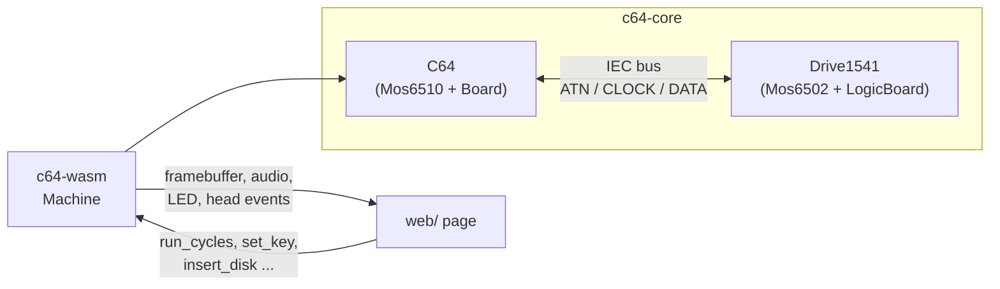
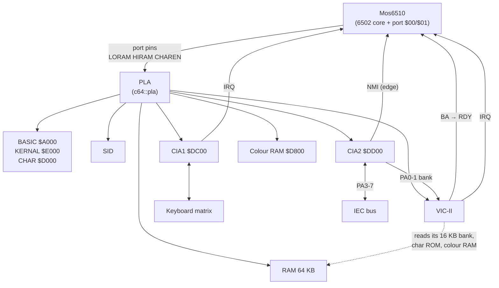
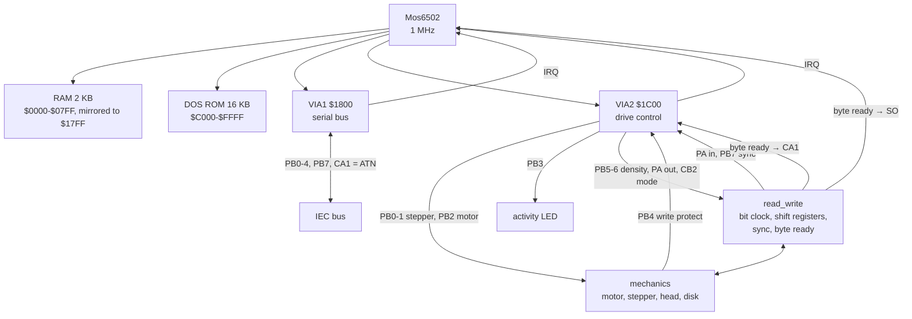
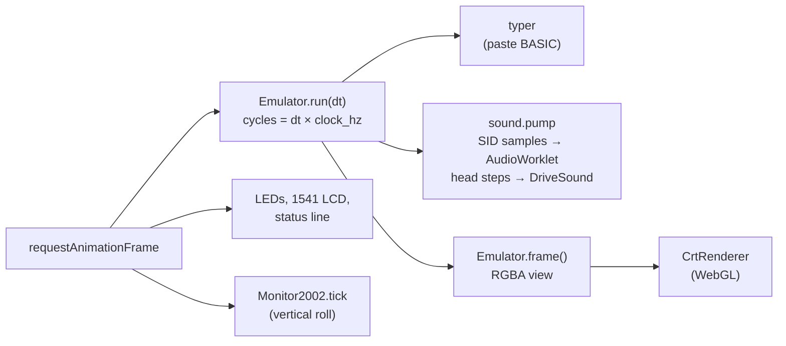

# Architecture

c64wasm has three layers:

| Layer | Where | Language | Role |
|---|---|---|---|
| Emulator core | `crates/c64-core` | Rust, no runtime dependencies | The C64 and the 1541, chip by chip, cycle by cycle |
| Bindings | `crates/c64-wasm` | Rust + wasm-bindgen | A thin `Machine` class for JavaScript |
| Page | `web/` | Plain ES modules, WebGL, WebAudio | Timing, the desk scene, the picture, sound, input, ROMs, disks |

The core knows nothing about browsers, real time or screens. It produces
an RGBA raster, audio samples, LED duty cycles and head-step events. The
page decides when to run it and how to show the results.



## The emulator core

### One module per chip

| Module | Contents |
|---|---|
| `cpu` | `Mos6502` (the core), `Mos6510` (core + I/O port), the `Bus` trait |
| `vic` | VIC-II: sequencer, sprites, graphics modes, borders, palette, model |
| `sid` | SID: oscillator, envelope, voice, filter, output stage, model |
| `cia` | 6526 CIA: ports, timers, interrupt control |
| `via` | 6522 VIA: ports, timers, control lines, interrupt flags |
| `port` | the 8-bit port with data-direction register, shared by CIA and VIA |
| `memory` | `Ram<N>` and `Rom<N>` |
| `clock` | `VideoStandard` (PAL/NTSC) and `ClockBridge` (between two crystals) |
| `led` | an indicator LED that records its duty cycle |
| `cbm_iec` | the serial bus: three wired-AND lines |
| `media` | `Disk` (raw GCR per half-track), D64, G64, GCR coding |
| `c64` | the C64: `Board`, `pla`, `keyboard`, `serial_port` |
| `drive1541` | the 1541: `mechanics` and `electronics` (`LogicBoard`, `read_write`, `serial_interface`) |
| `tools` | not part of the machine: BASIC tokenizer, ROM file loading |

A chip module describes the chip on its own, independent of where it is
soldered. How its pins are connected is the business of the board that
owns it: `c64::board`, `c64::serial_port`, `drive1541::electronics` and
`drive1541::electronics::serial_interface`. The same `Via6522` type is
both VIAs of the 1541, the same `Port` is in both CIAs and both VIAs, and
the same `Mos6502` runs the C64 (inside `Mos6510`) and the drive.

### Flavours

Chips that existed in several versions are one type with a model enum,
chosen when the machine is built:

| Enum | Values | What changes |
|---|---|---|
| `VideoStandard` | `Pal`, `Ntsc` | system clock (985,248 / 1,022,727 Hz), the VIC-II model |
| `VicModel` | `Pal` (6569), `Ntsc` (6567R8) | 63/65 cycles per line, 312/263 lines, sprite X origin, framebuffer column |
| `SidModel` | `Mos6581`, `Mos8580` | filter cutoff curve, mixer DC offset |
| `LedColor` | `Red`, `Green` | the colour a front end draws |

Memories are generic over their size, so the sizes are part of the type:
`Ram<65536>` and `Ram<1024>` (colour RAM, 4 bits used) in the C64,
`Ram<2048>` in the 1541, `Rom<8192>` for BASIC and KERNAL, `Rom<4096>` for
the character ROM and `Rom<16384>` for the DOS. `Rom::new` rejects an image
of the wrong size. RAM addresses wrap modulo `N`, which gives the 1541's
RAM mirroring for free.

### The `Bus` trait: how a CPU is wired

An NMOS 6502 does exactly one bus access per clock cycle, including dummy
reads and writes. The core performs every access through two functions,
`rd` and `wr`, and each of them first calls `Bus::tick()`. So:

- one `tick` = one CPU cycle = one cycle of everything else on that bus;
- the cycle count of an instruction follows from its access pattern;
- whatever is on the bus sees the CPU's accesses at the right moment
  relative to its own work.

```rust
pub trait Bus {
    fn read(&mut self, addr: u16) -> u8;
    fn write(&mut self, addr: u16, val: u8);
    fn tick(&mut self) -> bool { true }         // clock everything; returns RDY
    fn note_pc(&mut self, pc: u16) {}           // for the VIC-II's c-access quirk
    fn processor_port_changed(&mut self, pins: u8) {} // 6510 port -> PLA
    fn irq_pending(&self) -> bool { false }     // level
    fn nmi_edge_pending(&self) -> bool { false }
    fn take_nmi_edge(&mut self) -> bool { false } // edge, latched by the bus
    fn take_so_edge(&mut self) -> bool { false }  // the SO pin (1541 byte ready)
}
```

Within one cycle the order is fixed: `tick()` runs first (the other chips
do their work for this cycle), then the CPU's read or write lands. For a
write this means the target chip has already advanced to the next cycle
when it sees the write; the VIC-II's sprite-crunch check relies on this
(a write in cycle 15 arrives when `cycle == 16`).

`tick()` returns RDY. When it is false the CPU's read does not happen: the
cycle is counted and the same read is tried again next cycle. Writes are
never held, as on the real 6510.

The bus implementations are:

| Implementation | Used by |
|---|---|
| `c64::Board` | the C64's 6510 |
| `drive1541::electronics::LogicBoard` | the 1541's 6502 |
| `Mos6510`'s internal `PortBus` | puts the 6510 I/O port at $00/$01 in front of the board |
| test buses | 64 KB of plain RAM, for CPU unit tests and the Tom Harte harness |

### The C64



`C64` owns a `Mos6510` and a `Board`. The board owns everything else:
64 KB RAM, the three ROMs, colour RAM, VIC-II, SID, two CIAs, the
keyboard, the IEC bus and up to four drives (devices 8-11).

**Memory map.** `pla::cpu_read(port_pins, addr)` decides what answers a
CPU read, from the 6510 port's LORAM, HIRAM and CHAREN pins. The pins are
`(data & ddr) | !ddr`: input bits float high, so at power-on (DDR = 0)
everything reads 1 and BASIC, I/O and KERNAL are visible.

| Range | Visible |
|---|---|
| `$A000-$BFFF` | BASIC if LORAM and HIRAM, else RAM |
| `$D000-$DFFF` | RAM if LORAM and HIRAM are both 0; else character ROM if CHAREN is 0; else I/O |
| `$E000-$FFFF` | KERNAL if HIRAM, else RAM |
| everything else | RAM |

Writes go to RAM unless I/O is visible there; the ROMs have RAM
underneath. The cartridge lines GAME and EXROM are not modelled (always
high, as with no cartridge).

**I/O area.** VIC-II at `$D000` (64 registers, mirrored through `$D3FF`),
SID at `$D400` (32, mirrored through `$D7FF`), colour RAM at `$D800` (the
upper nibble reads as 1s), CIA1 at `$DC00`, CIA2 at `$DD00` (16 registers
each, mirrored). `$DE00-$DFFF` (cartridge I/O) reads `$FF`.

**One cycle** (`Board::tick`):

1. The VIC-II runs one cycle. It reads through a `VicMem` view: its 16 KB
   bank of RAM (bank = 3 − CIA2 PA0-1), the character ROM at `$1000-$1FFF`
   of banks 0 and 2, colour RAM, and the low nibble of the RAM byte at the
   CPU's program counter (for c-accesses during the first three cycles of
   BA low). It returns BA, which becomes the CPU's RDY.
2. CIA1 and CIA2 run one cycle.
3. CIA2's interrupt output is compared with last cycle's. A rising edge
   latches an NMI for the CPU (NMI is edge-triggered).
4. The SID runs one cycle.
5. If drives are attached, the serial bus is recomputed and each drive
   runs the cycles it is owed (see below).

**Interrupt lines.** IRQ is the OR of CIA1's interrupt output and the
VIC-II's (`irq_line()`); it is level-sensitive. NMI is the edge latch fed
by CIA2 and by RESTORE (`press_restore` sets the latch if CIA2 isn't
already holding the line).

**Keyboard.** `Keyboard` is an 8×8 switch matrix between CIA1 port A
(rows) and port B (columns). It is scanned whenever the CPU reads CIA1:
rows driven low on port A pull the columns of pressed keys low on port B,
and the other way round. Joysticks are not connected.

**Serial port.** `c64::serial_port` is CIA2's side of the IEC bus. The
outputs PA3 (ATN), PA4 (CLOCK) and PA5 (DATA) go through 7406 inverters, so
setting a bit pulls the line low. The inputs PA6 (CLOCK) and PA7 (DATA) read
0 while the line is low.

### The 1541



`Drive1541` owns a `Mos6502` and a `LogicBoard`. The logic board owns the
RAM, the ROM, both VIAs, the read/write electronics, the activity LED and
the `Mechanics` (motor, stepper, head, disk). Its `tick` is described in
[1541.md](1541.md).

### Two clocks: `ClockBridge`

The C64's clock comes from its colour crystal (PAL 985,248 Hz, NTSC
1,022,727 Hz); the 1541 has its own 16 MHz crystal divided by 16, so
1,000,000 Hz. They are not locked to each other, and the serial protocol
is asynchronous.

`ClockBridge` keeps the exact ratio with integers. Every host cycle adds
`device_hz` to a credit; the device may run while the credit is at least
`host_hz`; each device cycle subtracts `host_hz`. The drive runs whole
instructions, so it can be up to one instruction ahead; that shows as
negative credit and is paid back. There is no drift: after one emulated
second of a PAL C64 the drive has run 1,000,000 cycles, give or take one
instruction.

`Drive1541::run_from_host(&mut ClockBridge)` is called once per C64 cycle.
A jammed drive CPU clears its credit and stays jammed.

### The serial bus

`cbm_iec::IecBus` holds three lines: ATN, CLOCK and DATA, `true` meaning
asserted (pulled low). They are open-collector, so a line is asserted if
anyone asserts it. Only the computer drives ATN.

Every C64 cycle with drives attached (`Board::clock_serial_bus`):

1. The C64's output is decoded from CIA2 port A's pins.
2. Each drive's output is decoded from its VIA1 port B pins and the
   current ATN level (the ATN-acknowledge gate, see
   [1541.md](1541.md#the-serial-interface-via1)).
3. The lines are the OR of all outputs.
4. The lines go to CIA2 port A's inputs and to every drive's VIA1 (port B
   inputs and CA1).
5. Each drive runs the cycles it is owed.

So a change made by either side is seen by the other within one C64
cycle, which is finer than the protocol needs (its fastest edges are
several microseconds apart).

## The bindings: `c64-wasm`

`crates/c64-wasm/src/lib.rs` exposes one class, `Machine`, wrapping a `C64`:

| Area | Methods |
|---|---|
| Power and timing | `new(basic, kernal, chargen, ntsc)`, `clock_hz()`, `run_cycles(n)`, `jammed()` |
| Picture | `framebuffer_ptr()`, `framebuffer_width()`, `framebuffer_height()` |
| Keyboard | `set_key(row, col, pressed)`, `release_all_keys()`, `press_restore()` |
| Sound | `set_audio_rate(hz)`, `take_audio()`, `set_sid_8580(bool)` |
| Drive | `attach_drive(dos_rom, device)`, `insert_disk`, `eject_disk`, `extract_disk`, `drive_has_disk`, `drive_led`, `drive_motor`, `drive_track`, `drive_head_events` |

The framebuffer is read in place from wasm memory: the page makes a
`Uint8Array` view on `framebuffer_ptr()` every frame (memory can move when
it grows). The release build uses LTO and `opt-level = "s"` for the wasm
crate.

## The page

The page is plain ES modules with no build step. `web/src/main.js` wires
the parts together and runs the frame loop:



Each animation frame:

1. The loop caps the elapsed real time at 250 ms (so a background tab
   doesn't cause a huge catch-up), and `Emulator.run(dt)` turns it into a
   cycle budget at
   the machine's clock rate, keeps the fraction for the next frame, and
   calls `run_cycles`. In "as fast as possible" mode it runs 400,000 cycles
   per frame instead.
2. The BASIC typer, if busy, presses the next keys in emulated time.
3. `sound.pump` posts the SID's samples to the AudioWorklet and passes
   motor state and head steps to the drive sounds.
4. The frame's RGBA raster goes to the WebGL renderer as a texture.
5. LEDs, the 1541 display and the status line are updated, the 2002's
   vertical roll advances, and the renderer draws (including the power-on
   and power-off animation).

Modules by folder:

| Folder | Contents |
|---|---|
| `machine/` | `Emulator` (load wasm, power, pacing), `RomSet` (the ROMs in use), `DemoMachine` (still pictures when `web/pkg` isn't built) |
| `display/` | `CrtRenderer` (WebGL), `scene` (the two desk photos and the zoom), `monitor-2002` (the knobs behind the door, COMP/SEP), `drive-lcd`, `led` |
| `audio/` | `sound` (start/stop, volume), `sid-worklet` (jitter buffer), `drive-sound` (synthesized motor, steps, head bang) |
| `input/` | `keyboard-map` (PC keys to matrix cells), `keyboard`, `typer` |
| `media/` | `disk` (D64/G64 recognition, label), `disk-slot` (the disk survives power-off) |
| `roms/` | slots and known CRCs, IndexedDB library, listing parser, repair, character ROM from text or picture, sources, CRC32 algebra |
| `ui/` | settings dialog, ROM manager, first-run dialog, knobs, DOM helpers |
| `settings.js` | settings in `localStorage` |

Details are in [web.md](web.md).

## Where state lives

| State | Where |
|---|---|
| The running machine | wasm memory, discarded at power-off |
| The disk in the drive | `DiskSlot` in the page; taken back from the drive as a D64 at power-off, eject and save |
| ROM images | IndexedDB, per slot, with the active one marked; never uploaded |
| Settings | `localStorage` |
| ROMs for native tests | `roms/` (git-ignored) |
